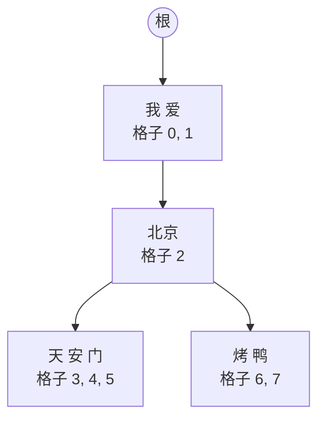

# mini-sglang 问答：KV cache 和 radix 树

读 mini-sglang 的 KV cache 时问过的问题和答案，用中文写，方便自己复习。代码都对应 upstream [`9a91cfa`](https://github.com/sgl-project/mini-sglang/tree/9a91cfafe754aa85daee49998176275667eb58f2)，和 nano-vllm [`bb823b3`](https://github.com/GeeeekExplorer/nano-vllm/tree/bb823b3e06983d71485a8e1f23715ebd87d98ef8) 对比。2026-10-07 整理，之后陆续补充。进程结构的问题在 [QA-processes.md](QA-processes.md)。

数字都来自 RTX 4060 Laptop（8 GB）上的 Qwen3-0.6B：28 层，8 个 KV head，每个 head 128 维，bf16。

**目录**（由浅入深）

1. 是不是每个 token 一个 KV 格子？用的时候再拼起来？
2. 47008 个 token 是不是很小？
3. vLLM / nano-vllm 的 block 属于一个序列，还是一个 batch？
4. radix 树：用真实 token 走一遍
5. KV cache 在显存里怎么放：分配、步长、地址
6. 写：store kernel
7. 读：batch 不拼接，只给 attention 一张编号表
8. decode 一步要读多少字节
9. nano-vllm（vLLM）的 block 在显存里怎么放
10. 块大小怎么取舍
11. 自测：做过的题和纠正
12. 下一步要想的问题

---

## 是不是每个 token 一个 KV 格子？用的时候再拼起来？

前半句对：默认 `page_size=1`，每个 token 占一个**格子**，28 层都用同一个格子号。后半句不对：**不会拼成一块新内存**，而是交给 attention kernel 一张"格子编号表"，kernel 按编号直接去读。

**page_table**：每个请求一行，第几列就是第几个 token，格子里存的是格子号。例如"我爱北京天安门"是 6 个 token，用了 0 到 5 号格子，它那一行就是 `[0, 1, 2, 3, 4, 5]`。

| 时机 | 做什么 | 代码 |
|---|---|---|
| 写 | 这一步新 token 的 K/V 写到哪个格子（`out_loc`），从 page_table 取 | [scheduler.py L210](https://github.com/sgl-project/mini-sglang/blob/9a91cfafe754aa85daee49998176275667eb58f2/python/minisgl/scheduler/scheduler.py#L210) |
| 读 | 把每个请求那一行接成 `indices` 交给 FlashInfer | [fi.py L215](https://github.com/sgl-project/mini-sglang/blob/9a91cfafe754aa85daee49998176275667eb58f2/python/minisgl/attention/fi.py#L215) |

和 nano-vllm 是同一个思路：nano-vllm 的 `block_tables` 写 `[5, 9, 12]` 表示用了 5、9、12 号块，每块 256 个 token；mini-sglang 相当于块大小是 1，表里直接写每个 token 的格子号。

---

## 47008 个 token 是不是很小？

先看这个数怎么来的（[engine.py L148-L161](https://github.com/sgl-project/mini-sglang/blob/9a91cfafe754aa85daee49998176275667eb58f2/python/minisgl/engine/engine.py#L148-L161)）：

```
每个 token 的 K + V = 2 × 28 层 × 8 个 KV head × 128 维 × 2 字节 = 114,688 字节 = 112 KiB
给 KV cache 的显存 = 0.9 × 6.92 GiB（空闲显存）− 模型占用（约 1.2 GiB）≈ 5.02 GiB
5.02 GiB ÷ 112 KiB ≈ 47,000 → 47008 个 token
```

100 个请求平均下来是 47008 ÷ 100 ≈ **470** 个 token，**包括 prompt**。但要注意：

1. 这是**同一时刻**的总量。请求结束后格子还回来，后面的请求接着用。
2. 请求进场时就按 prompt + `max_tokens` 预留（[prefill.py L48](https://github.com/sgl-project/mini-sglang/blob/9a91cfafe754aa85daee49998176275667eb58f2/python/minisgl/scheduler/prefill.py#L48)），放不下的排队，不会崩。
3. 共同的前缀只存一份：100 个请求带同一段 1000 token 的 system prompt，只占 1000 个格子。
4. 小是因为卡小：同一个模型放在 141 GB 的 H200 上能放上百万个 token。nano-vllm 在同一张卡上是约 163 块 × 256 ≈ 4.2 万个，差不多。

---

## vLLM / nano-vllm 的 block 属于一个序列，还是一个 batch？

**属于一个序列**。一个 block 装的是同一个序列里连续的 token（nano-vllm 256 个，vLLM 默认 16 个）；每个序列有自己的 `block_table`；batch 只是"这一步一起算的序列"，自己不占 block。唯一的例外是前缀缓存：开头相同的序列可以共用**装满的** block（只读，`ref_count` 记有几个序列在用）。

| | nano-vllm | mini-sglang |
|---|---|---|
| 分配单位 | 256 个 token 一块 | 1 个 token 一格 |
| 每个序列的表 | `block_table`：块号 | page_table 的一行：格子号 |
| 最后一块 | 常常装不满 | 没有浪费 |
| 前缀共享 | 只能共享装满的整块（逐块串起来的 hash） | 任意长度（radix 树） |

---

## radix 树：用真实 token 走一遍

树的每个节点存一段 token（[radix_cache.py L17](https://github.com/sgl-project/mini-sglang/blob/9a91cfafe754aa85daee49998176275667eb58f2/python/minisgl/kvcache/radix_cache.py#L17)）：

| 字段 | 存什么 |
|---|---|
| `key` | 这一段的 token id |
| `value` | 这些 token 的 KV 在哪些格子（和 key 一样长） |
| `children` | 子节点，按子节点的第一个 token 查（[L236](https://github.com/sgl-project/mini-sglang/blob/9a91cfafe754aa85daee49998176275667eb58f2/python/minisgl/kvcache/radix_cache.py#L236)） |
| `ref_count` | 有几个正在跑的请求在用；0 表示可以驱逐 |

从根往下的任意一条路就是一个前缀。三个请求依次到来，下面是 Qwen3 tokenizer 和 mini-sglang 的 `RadixPrefixCache` 的真实输出：

**① A = "我爱北京天安门"** → `我 / 爱 / 北京 / 天 / 安 / 门`。prefill 用了 0 到 5 号格子，算完插入树（`insert_prefix`，[L136](https://github.com/sgl-project/mini-sglang/blob/9a91cfafe754aa85daee49998176275667eb58f2/python/minisgl/kvcache/radix_cache.py#L136)）：

```
[我 爱 北京 天 安 门]  slots=[0, 1, 2, 3, 4, 5]
```

**② B = "我爱北京烤鸭"** → `我 / 爱 / 北京 / 烤 / 鸭`。进场时调度器拿**除了最后一个 token 以外**的部分去匹配（[cache.py L30](https://github.com/sgl-project/mini-sglang/blob/9a91cfafe754aa85daee49998176275667eb58f2/python/minisgl/scheduler/cache.py#L30)）：最后一个 token 必须重算，要用它的输出采样第一个新 token（道理同 nano-vllm [#114](https://github.com/GeeeekExplorer/nano-vllm/issues/114)）。`_tree_walk`（[L205](https://github.com/sgl-project/mini-sglang/blob/9a91cfafe754aa85daee49998176275667eb58f2/python/minisgl/kvcache/radix_cache.py#L205)）按"我"找到 A 的节点，逐个比，前 3 个相同、第 4 个不同。只匹配了一部分，就把节点**劈开**（`split_at`，[L69](https://github.com/sgl-project/mini-sglang/blob/9a91cfafe754aa85daee49998176275667eb58f2/python/minisgl/kvcache/radix_cache.py#L69)）：

```
match B -> cached_len 3, slots [0, 1, 2]
[我 爱 北京]  slots=[0, 1, 2]
    [天 安 门]  slots=[3, 4, 5]
```

B 的 page_table 前 3 格直接填 `[0, 1, 2]`（[prefill.py L61](https://github.com/sgl-project/mini-sglang/blob/9a91cfafe754aa85daee49998176275667eb58f2/python/minisgl/scheduler/prefill.py#L61)），只需要算"烤 鸭"，用新的 6、7 号格子。B 算完插入树：

```
[我 爱 北京]  slots=[0, 1, 2]
    [天 安 门]  slots=[3, 4, 5]
    [烤 鸭]     slots=[6, 7]
```

**③ C = "我爱上海"** → `我 / 爱 / 上海`，只匹配不插入：

```
match C -> cached_len 2, slots [0, 1]
[我 爱]  slots=[0, 1]
    [北京]  slots=[2]
        [天 安 门]  slots=[3, 4, 5]
        [烤 鸭]     slots=[6, 7]
```

C 还没插入，树就已经被劈开了：**匹配本身也会劈节点**。



总结：共同的开头只存一份（"我 爱"的 KV 只在 0、1 号格子里，三个请求都用）；找的时候从根往下一段段比，比到第一个不同的 token 停下；新请求在某个节点中间分叉，就把那个节点劈开。nano-vllm 按 256 个 token 一块算 hash，"我爱北京"这种不满一块的前缀根本共享不了。

<details>
<summary>演示代码（CPU 上就能跑）</summary>

```python
import torch
from transformers import AutoTokenizer
import minisgl.core as core
from minisgl.kvcache.radix_cache import RadixPrefixCache

tok = AutoTokenizer.from_pretrained("Qwen/Qwen3-0.6B")
core.set_global_ctx(core.Context(page_size=1))
cache = RadixPrefixCache(device=torch.device("cpu"))
ids = lambda s: torch.tensor(tok(s, add_special_tokens=False)["input_ids"], dtype=torch.int32)

A, B, C = ids("我爱北京天安门"), ids("我爱北京烤鸭"), ids("我爱上海")
cache.insert_prefix(A, torch.arange(len(A), dtype=torch.int32))   # A 用格子 0..5
m = cache.match_prefix(B[:-1])                                     # B 进场：匹配到 3 个
b_slots = torch.cat([m.cuda_handle.get_matched_indices(), torch.tensor([6, 7], dtype=torch.int32)])
cache.insert_prefix(B, b_slots)                                    # B 算完插入
m = cache.match_prefix(C[:-1])                                     # C 进场：匹配到 2 个
# 遍历 cache.root_node.children 打印每个节点的 _key 和 value
```

</details>

---

## KV cache 在显存里怎么放：分配、步长、地址

**一次 `torch.empty`，一整块连续的显存**（[mha_pool.py L28-L29](https://github.com/sgl-project/mini-sglang/blob/9a91cfafe754aa85daee49998176275667eb58f2/python/minisgl/kvcache/mha_pool.py#L28-L29)）：

```
形状 (2, 28, 47009, 1, 8, 128)：K 和 V、28 层、格子编号、每格 1 个 token、8 个 KV head、每个 head 128 维
2 × 28 × 47009 × 1 × 8 × 128 = 2,695,684,096 个 bf16 = 5,391,368,192 字节 = 5.02 GiB
```

47009 比 47008 多 1：多出的是一个 dummy 格子。CUDA graph 补位用的假请求，它在 page_table 里那一行全填成 47008（[engine.py L98](https://github.com/sgl-project/mini-sglang/blob/9a91cfafe754aa85daee49998176275667eb58f2/python/minisgl/engine/engine.py#L98)），所以假请求读写的都是这个没人用的格子。

在 GPU 看来这只是**一长串字节**。6 个维度只是"下标怎么换算成地址"，靠每一维的**步长**（stride）。真实的数：

| 维度 | 大小 | 步长（元素） | 换成字节 | 意思 |
|---|---|---|---|---|
| K/V | 2 | 1,347,842,048 | 2.51 GiB | 前一半全是 K，后一半全是 V |
| 层 | 28 | 48,137,216 | 91.8 MiB | 每层的 K 是连续的一段 |
| 格子 | 47009 | 1024 | **2 KiB** | 相邻两个格子相隔 2 KiB |
| 格子内位置 | 1 | 1024 | — | page_size=1，只有 1 |
| KV head | 8 | 128 | 256 B | |
| 维度 | 128 | 1 | 2 B | |

```
地址 = 起点 + 2 字节 × (kv × 1,347,842,048 + 层 × 48,137,216 + 格子 × 1024 + head × 128 + 维)
```

```
[K 第0层][K 第1层] … [K 第27层][V 第0层] … [V 第27层]      ← 整块 5.02 GiB
    └─ 一层 = [格子0][格子1] … [格子47008]                  ← 91.8 MiB
                └─ 一个格子 = 8 个 head × 128 维 × 2 字节 = 2 KiB，连续
```

在一个只有 10 个格子的小 KV 池上实测的字节偏移：K 第 0 层格子 0 → 0；格子 1 → 2048；K 第 1 层格子 0 → 20480（10 × 2048）；V 第 0 层格子 0 → 573440（28 × 10 × 2048），和公式一致。

为什么这样排：第 l 层的 attention 只用第 l 层的 K 和 V，正好是两段连续的内存；一个 token 在一层里的 K 是 2 KiB 连续的，GPU 每次从显存读 32 到 128 字节一段，整块 2 KiB 读进来没有浪费，所以格子编号乱序（0、1、2、6、7、9）读起来也几乎和顺序读一样快。

---

## 写：store kernel

每一层 attention 一开始，先把这一步新 token 的 K、V 存进去（`fi.py` 的 `forward` 调 `store_kv(k, v, batch.out_loc, layer_id)`），一步 28 次。kernel 是 [store.cu](https://github.com/sgl-project/mini-sglang/blob/9a91cfafe754aa85daee49998176275667eb58f2/python/minisgl/kernel/csrc/jit/store.cu)，**每个 warp（32 个线程）负责一个 token**：

1. `pos = indices[warp_id]`：这个 token 写到哪个格子
2. 目标 = 这一层 K 的起点 + `pos × 2048` 字节
3. 32 个线程每人拷 64 字节，合起来 2048 字节；V 也一样

一个 block 128 个线程 = 4 个 warp = 4 个 token。实测：把 3 个新 token 写进格子 `[8, 2, 5]`，读回来完全一致。

这个 kernel 第一次用时现场编译，tvm-ffi 的编译缓存目录叫 `minisgl__store_2048_128_1_false_<hash>`，名字就是编译参数：一个 token 2048 字节、每个 block 128 个线程、每个 SM 最多 1 个 block、不用 PDL。

---

## 读：batch 不拼接，只给 attention 一张编号表

batch 在内存里从来不会被拼成一块，它只是一份描述。上面的 A、B 一起 decode 一步，新 token 分别写进 8、9 号格子：

```
indices = [0, 1, 2, 3, 4, 5, 8,   0, 1, 2, 6, 7, 9]
indptr  = [0, 7, 13]          → A 是 indices[0:7]，B 是 indices[7:13]
```

0、1、2 号格子出现两次：只存一份，A 和 B 各读一次。

| 步 | 做什么 | 代码 |
|---|---|---|
| 每步开始 | 在 CPU 上把每个请求那一行 page_table 接成 `indices`，算出 `indptr` | [fi.py L190-L226](https://github.com/sgl-project/mini-sglang/blob/9a91cfafe754aa85daee49998176275667eb58f2/python/minisgl/attention/fi.py#L190-L226) |
| 每步一次 | `plan`：FlashInfer 根据这两个数组决定怎么分活 | [fi.py L123-L165](https://github.com/sgl-project/mini-sglang/blob/9a91cfafe754aa85daee49998176275667eb58f2/python/minisgl/attention/fi.py#L123-L165) |
| 每层一次（28 次） | `run`：对每个请求按编号读 K、V（地址 = 层起点 + 格子号 × 2 KiB），算 q·K、softmax、乘 V | |

实测：FlashInfer 按编号直接读算出的结果，和"手动把 `K[格子]` 取出来拼好再算"的结果，最大差别 0.0038 和 0.0068，只是 bf16 的舍入误差。

模型的其他部分不需要这份描述：这一步所有请求的新 token 排成一个 `[token 数, 1024]` 的矩阵，每个线性层对所有人只做一次矩阵乘法。只有 attention 需要知道"谁的历史在哪"。

还有一处省显存：Qwen3-0.6B 有 16 个 query head，但只有 8 个 KV head，每 2 个 query head 共用一个（GQA），KV cache 只存 8 个，省一半。

---

## decode 一步要读多少字节

每一步都要从显存读：**所有权重**（0.6B 个参数 × 2 字节 ≈ 1.2 GB），加上**每个请求的全部 KV**（1000 个 token × 112 KiB ≈ 110 MiB）。

实测一个请求每步约 8 ms：

```
(1.2 GB + 0.1 GB) ÷ 8 ms ≈ 160 GB/s
```

RTX 4060 Laptop 的显存带宽标称约 256 GB/s，用到了六成左右。只有一个请求时，时间主要花在读权重上；100 个请求一起 decode，权重还是只读一遍，却产出 100 个 token。这就是 batch 能提高 decode 吞吐的原因。

---

## nano-vllm（vLLM）的 block 在显存里怎么放

**排法完全一样，只是第 4 维不同。**

| | 形状 | 第 4 维 |
|---|---|---|
| nano-vllm | `(2, 28, 约163, 256, 8, 128)` | 一块装 256 个 token |
| mini-sglang | `(2, 28, 47009, 1, 8, 128)` | 一格装 1 个 token |

nano-vllm 也是一次 `torch.empty`，然后把第 l 层的那段交给第 l 个 attention 层（[model_runner.py L112-L120](https://github.com/GeeeekExplorer/nano-vllm/blob/bb823b3e06983d71485a8e1f23715ebd87d98ef8/nanovllm/engine/model_runner.py#L112-L120)）。用步长算"第 b 块的第 o 个位置"：

```
b × 262,144 + o × 1024 = (b × 256 + o) × 1024 个元素 = (b × 256 + o) × 2 KiB
                         └─ nano-vllm 的 slot ─┘
```

和 mini-sglang 的"格子号 × 2 KiB"是同一个公式：nano-vllm 的 `slot` 和 mini-sglang 的格子号是一回事。

| | nano-vllm | 代码 |
|---|---|---|
| 写 | Triton kernel，每个 token 一个程序实例，`cache_offsets = slot * D`（D = 1024），写到 `slot × 2 KiB` | [attention.py L11-L40](https://github.com/GeeeekExplorer/nano-vllm/blob/bb823b3e06983d71485a8e1f23715ebd87d98ef8/nanovllm/layers/attention.py#L11-L40) |
| slot 怎么算 | `block_table[i] × 256 + 块内位置`，在 CPU 上算好 | [model_runner.py L154-L161](https://github.com/GeeeekExplorer/nano-vllm/blob/bb823b3e06983d71485a8e1f23715ebd87d98ef8/nanovllm/engine/model_runner.py#L154-L161)、[L181](https://github.com/GeeeekExplorer/nano-vllm/blob/bb823b3e06983d71485a8e1f23715ebd87d98ef8/nanovllm/engine/model_runner.py#L181) |
| 读 | flash-attn，传 `block_tables` 和 `context_lens`；kernel 自己算 `块号 = block_tables[序列][p // 256]`、`块内位置 = p % 256` | [attention.py L63-L73](https://github.com/GeeeekExplorer/nano-vllm/blob/bb823b3e06983d71485a8e1f23715ebd87d98ef8/nanovllm/layers/attention.py#L63-L73) |

同一个 A、B 的例子：

| | nano-vllm（每块 256） | mini-sglang（每格 1） |
|---|---|---|
| A 存在哪 | 第 0 块，slot 0 到 6 | 格子 0 到 5，新 token 在 8 |
| B 存在哪 | 第 1 块，slot 256 到 261 | 格子 0、1、2（和 A 共用），6、7，新 token 在 9 |
| "我 爱 北京"存几份 | 两份（3 个 token 不满一块，共享不了） | 一份 |
| 交给 attention 的 | `block_tables=[[0], [1]]`，`context_lens=[7, 6]` | `indices=[0,1,2,3,4,5,8, 0,1,2,6,7,9]`，`indptr=[0,7,13]` |
| 这一步新 token 写到哪 | `slot_mapping=[6, 261]` | `out_loc=[8, 9]` |

A 只用了第 0 块 256 个位置里的 7 个，97% 空着。整张卡约 163 块，所以不管序列多短，nano-vllm 最多同时放约 163 个序列。

**为什么偏偏是 256**：nano-vllm 用 flash-attn 做 attention，flash-attn 的文档写着 "page_block_size must be a multiple of 256"（flash-attn 2.8.3，`flash_attn_with_kvcache`）。mini-sglang 用的 FlashInfer 没有这个限制，维护者在 [PR #110](https://github.com/sgl-project/mini-sglang/pull/110) 里说 "in SGLang, we also treat the page-size = 1 for flashinfer backend"。真正的 vLLM 默认每块 16 个 token，用自己的 attention kernel。

---

## 块大小怎么取舍

| | 大块（nano-vllm 256） | 每格 1 个（mini-sglang 默认） |
|---|---|---|
| 浪费 | 每个序列最后一块平均空一半：128 × 112 KiB ≈ 14 MiB；100 个序列 1.4 GiB | 不浪费 |
| 前缀共享 | 只能共享装满的整块 | 任意长度 |
| 每步交给 attention 的表 | 小：100 个序列 × 1000 个 token，`block_tables` 只有 100 × 4 个数 | 大：同样情况 `indices` 有 10 万个数（400 KB），每步在 CPU 上拼好再拷到 GPU |
| kernel | 一次读一整块连续的 token，适合 flash-attn | 按编号一个个读，要专门设计的 kernel（FlashInfer） |

mini-sglang 也能用块：`--page-size 16`；用 trtllm 后端时会强制改成 64（`engine.py` 的 `_adjust_config`）。page_size 只改变"按多大一块分格子、按多大一块共享前缀"（radix 树匹配时向下对齐到整页），显存里的排法不变。

---

## 自测：做过的题和纠正

2026-10-07：

| 当时的想法 | 结果 | 纠正 |
|---|---|---|
| 每个 token 一个 KV 格子，用的时候再拼在一起 | ⚠️ 前半对 | 不拼接；给 kernel 一张格子编号表，按编号直接读。实测结果和手动拼接后再算一致 |
| 47008 ÷ 100 条，平均最多生成 4700 个 | ⚠️ 算错一位，理解也要补 | 是 470 个，而且包括 prompt；这是同一时刻的总量，请求结束后格子会还回来；共同的前缀只存一份 |
| block 是一个序列的还是一个 batch 的？ | | 一个序列的；batch 不占 block |
| 预测 A、B、C 依次到来后 radix 树的样子 | ✅ | 和真实运行的输出一模一样 |

---

## 下一步要想的问题

- 演示里所有节点的 `ref_count` 都是 0，因为没有"锁"。真实运行时 B 进场后哪些节点变成 1？B 结束后呢？（看 `lock_handle`，以及它在 `prefill.py`、`cache.py` 里被调用的地方）
- 如果 A 和 B **在同一步**进场，B 匹配时 A 还没插入树，会发生什么？B 的那 3 个格子和 A 的那 3 个格子，谁留在树里、谁被释放？B 的 page_table 指着哪一份？（[PR #142](https://github.com/sgl-project/mini-sglang/pull/142)、[PR #154](https://github.com/sgl-project/mini-sglang/pull/154) 说的就是这里）
- 加 `--page-size 16`，KV cache 张量的形状和步长变成什么？格子号和 page_table 里存的数还是一回事吗？（[PR #80](https://github.com/sgl-project/mini-sglang/pull/80)、[PR #110](https://github.com/sgl-project/mini-sglang/pull/110)）
- 一个 decode 步，batch 里 100 个请求、每个 1000 个 token：attention 要从 KV cache 读多少字节？和读一遍权重比哪个大？
