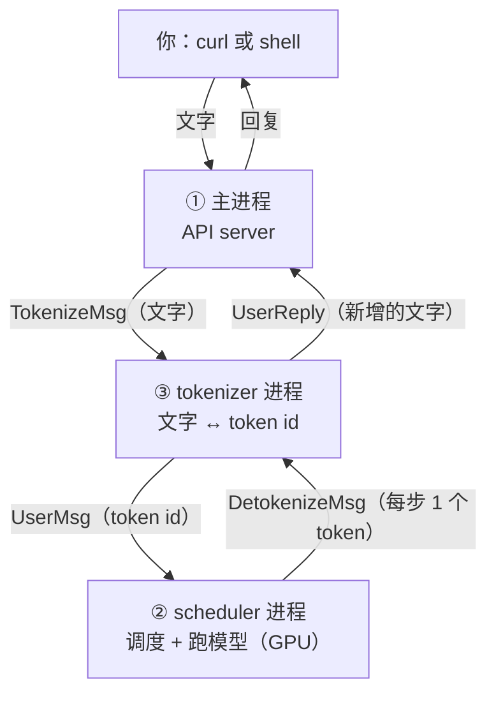

# mini-sglang 问答：进程结构

把 mini-sglang 跑起来时（离线脚本、对话模式、server 加 curl）问过的问题和答案，用中文写，方便自己复习。代码都对应 upstream [`9a91cfa`](https://github.com/sgl-project/mini-sglang/tree/9a91cfafe754aa85daee49998176275667eb58f2)。2026-10-07 整理，之后陆续补充。KV cache 和 radix 树的问题在 [QA-kv-cache.md](QA-kv-cache.md)。

**目录**（由浅入深）

1. 三种跑法
2. 对话模式下 `ps` 出来这么多进程，都是谁
3. server 的启动日志逐段在说什么
4. 一个请求怎么在进程之间走
5. 为什么要把 tokenizer 单独放一个进程
6. 为什么 tokenizer 能开好几个，detokenizer 只有一个
7. 自测：做过的题和纠正
8. 下一步要想的问题

---

## 三种跑法

| 跑法 | 命令 | 进程数 |
|---|---|---|
| 离线脚本 | `LLM(...).generate(prompts, SamplingParams(...))` | 1 个 |
| 对话（shell） | `python -m minisgl --model Qwen/Qwen3-0.6B --shell` | 主进程 + 2 个后台进程 |
| server | `python -m minisgl --model Qwen/Qwen3-0.6B`，然后 `curl http://127.0.0.1:1919/v1/chat/completions` | 主进程 + 2 个后台进程 |

离线脚本最少：离线的 `LLM` 本身就是调度器（`class LLM(Scheduler)`，[llm.py](https://github.com/sgl-project/mini-sglang/blob/9a91cfafe754aa85daee49998176275667eb58f2/python/minisgl/llm/llm.py)），自己做 tokenize，不需要进程之间传消息。

用 curl 发请求时两个小坑：`"model"` 必须写（随便什么字符串都行）；`max_tokens` 不写默认只有 16。

---

## 对话模式下 ps 出来这么多进程，都是谁？

对话模式开着时 `ps -ef | grep python` 看到的（命令行有删减）：

| PID | 命令 | 是谁 |
|---|---|---|
| 30884 | `python -m minisgl --model ... --shell` | **主进程**：接收输入，把请求交给后台，把结果拼成回复 |
| 30959 | `python -c "from multiprocessing.spawn import spawn_main; ..." (pipe_handle=21)` | **scheduler 进程**（代码里叫 `minisgl-TP0-scheduler`）：加载模型、管 KV cache、每一步选一批请求跑 GPU。唯一用 GPU 的进程 |
| 30960 | 同上，`pipe_handle=23` | **tokenizer 进程**（代码里叫 `minisgl-detokenizer-0`）：文字 → token id，也负责 token id → 文字 |
| 30958 | `python -c "from multiprocessing.resource_tracker import main; ..."` | Python 自己的辅助进程。用 `spawn` 方式开子进程时会自动起一个，进程意外退出时负责回收共享资源。不是 mini-sglang 写的 |

怎么认出谁是谁：scheduler 最先启动（handle 号最小），而且 CPU 时间最多（44 秒，加载模型、录 CUDA graph 都在它这里）；tokenizer 进程只用了 7 秒。



| 事实 | 代码 |
|---|---|
| 启动顺序：每张 GPU 一个 scheduler → 1 个 detokenizer → `num_tokenizer` 个 tokenizer；等所有后台进程报到（共 `num_tokenizer + 2` 个）才开始服务 | [launch.py L47-L111](https://github.com/sgl-project/mini-sglang/blob/9a91cfafe754aa85daee49998176275667eb58f2/python/minisgl/server/launch.py#L47-L111) |
| `num_tokenizer` 默认 0：转文字和转回文字由同一个进程做（`share_tokenizer`） | [args.py L21-L31](https://github.com/sgl-project/mini-sglang/blob/9a91cfafe754aa85daee49998176275667eb58f2/python/minisgl/server/args.py#L21-L31) |
| 对话模式和 server 模式的后台完全一样，只是主进程一个跑 uvicorn（HTTP），一个跑终端对话 | [api_server.py L447-L452](https://github.com/sgl-project/mini-sglang/blob/9a91cfafe754aa85daee49998176275667eb58f2/python/minisgl/server/api_server.py#L447-L452) |

---

## server 的启动日志逐段在说什么？

方括号里的标签能看出是谁打印的：没有标签、`initializer`、`FrontendAPI`、`INFO:` 是主进程；`core|rank=0` 是 scheduler 进程。

| 时间 | 日志 | 意思 |
|---|---|---|
| 22:32:29 | `Parsed arguments: ServerArgs(...)` | 所有参数的最终值。默认：同时最多 256 个请求（`max_running_req`），每步 prefill 最多 8192 个 token（`max_extend_tokens`），radix cache，端口 1919 |
| 22:32:32 | `[initializer] Tokenize server 0 is ready` | tokenizer 进程报到，主进程把它打印出来 |
| 22:32:34 | `Auto-selected attention backend: fi` | scheduler 开始初始化；SM89 的卡选 FlashInfer |
| | `[Gloo] Rank 0 is connected to 0 peer ranks` | 只有一张卡也会建一个通信组（gloo，地址是端口 + 1 = 1920），组里只有自己 |
| 22:32:35 | `Free memory before loading model: 6.92 GiB` | 8 GB 的卡，系统先占了一些 |
| 22:32:39 | `Allocating 47008 tokens for KV cache, K + V = 5.02 GiB` | 剩下的显存给 KV cache，算法见 [QA-kv-cache.md](QA-kv-cache.md)（"47008 个 token 是不是很小"一节） |
| | `Start capturing CUDA graphs with sizes: [1, 2, 4, 8, ..., 160]` | 23 个 batch size 各录一个 graph；显存小于 80 GiB 时上限 160（[graph.py L49-L62](https://github.com/sgl-project/mini-sglang/blob/9a91cfafe754aa85daee49998176275667eb58f2/python/minisgl/engine/graph.py#L49-L62)） |
| 22:32:41 | `Capturing graphs ... 23/23 [00:02]` | 2 秒。第一次跑时要现场编译 kernel，用了 55 秒 |
| 22:32:42 | `Scheduler is idle, waiting for new reqs...` | 没活干了，开始等消息 |
| | `[initializer] Scheduler is ready` → `Uvicorn running on http://127.0.0.1:1919` | 两个后台进程都报到，主进程开始接 HTTP |
| 22:33:44 | `POST /v1/chat/completions 200 OK`，然后又是 `Scheduler is idle` | 一个请求处理完，scheduler 又空闲了 |

`Scheduler is idle` 每次空闲都会打印（[scheduler.py L78-L80](https://github.com/sgl-project/mini-sglang/blob/9a91cfafe754aa85daee49998176275667eb58f2/python/minisgl/scheduler/scheduler.py#L78-L80)）。空闲时它还会调用 `check_integrity()` 检查 KV cache 的账，就是 issue [#149](https://github.com/sgl-project/mini-sglang/issues/149) 说"只查了数量"的那个检查。

---

## 一个请求怎么在进程之间走？

| 步 | 从 → 到 | 消息 | 内容 |
|---|---|---|---|
| 1 | curl → 主进程 | HTTP | 文字 |
| 2 | 主进程 → tokenizer 进程 | `TokenizeMsg` | 文字 |
| 3 | tokenizer 进程 → scheduler | `UserMsg` | token id |
| 4 | scheduler | | 排队、prefill、decode；**每一步**出 1 个新 token |
| 5 | scheduler → tokenizer 进程 | `DetokenizeMsg` | 这一步的 1 个 token，以及是否结束 |
| 6 | tokenizer 进程 → 主进程 | `UserReply` | 新增的文字 |
| 7 | 主进程 → curl | | 流式就一段段发；非流式等到结束一次发完 |

消息类型都在 [`message/`](https://github.com/sgl-project/mini-sglang/tree/9a91cfafe754aa85daee49998176275667eb58f2/python/minisgl/message)。进程之间用 ZMQ 传，地址是 `/tmp/minisgl_*` 这样的文件，后面带着主进程的 pid，所以同时开两个 server 不会串。

---

## 为什么要把 tokenizer 单独放一个进程？

**scheduler 每一步都要喂 GPU**：选这一步跑谁、准备输入、把 GPU 的活发出去。它在 CPU 上做别的事的时候，GPU 就在等。tokenize（套聊天模板、把一长段文字切成 token）和 detokenize（每一步把每个请求的新 token 转回文字）都是纯 CPU 的活。放在 scheduler 里做，来一个长 prompt，所有正在 decode 的请求都要陪它等。

为什么是进程不是线程：Python 一个进程里同一时刻只能跑一段 Python 代码（GIL），开线程也不能真正同时算；分成进程才能用上别的 CPU 核。

nano-vllm 不这样做也没关系：它是离线的，所有 prompt 在第一步之前就 tokenize 完了，不会卡住 decode。在线服务的请求是边 decode 边进来的，这时候拆进程才有意义。

**实测**（RTX 4060 Laptop，Qwen3-0.6B）：

| 测什么 | 结果 |
|---|---|
| tokenize `"hello world " * 4000` | 8001 个 token，28.3 ms（每个 token 3.5 µs） |
| 一个请求生成 1000 个 token | 8.08 s，每步约 8 ms |

要按"一次卡住多久"来比，不能按"每个 token 多少"来比：

```
切一个 8000 token 的 prompt：28 ms ≈ 3.5 个 decode 步
```

这 28 ms 里 GPU 停着，**所有**正在 decode 的请求（server 上可能一两百个）都多等 3.5 步。每秒来 10 个这样的请求，就是每秒 280 ms，scheduler 有 28% 的时间在切文字，而不是在喂 GPU。

---

## 为什么 tokenizer 能开好几个，detokenizer 只有一个？

因为 **detokenizer 要为每个请求记状态，tokenizer 不用**。

一个字可能被切成好几个 token，每个单独解码都是乱码，合起来才对。用 Qwen3 的 tokenizer 实测：

```
'龘' → ids = [82912, 246]
   82912 单独解码 → '�'
   246   单独解码 → '�'
   两个一起解码    → '龘'
```

decode 一步只出一个 token，所以 detokenizer 收到 82912 时还不能发给用户，要记住它，等下一步的 246 到了合起来才是"龘"：

| 做什么 | 代码 |
|---|---|
| 每个请求（uid）一份 `DecodeStatus`：收到过的 token、已经发出去多少文字 | [detokenize.py L75](https://github.com/sgl-project/mini-sglang/blob/9a91cfafe754aa85daee49998176275667eb58f2/python/minisgl/tokenizer/detokenize.py#L75) |
| 解出来的文字以 `�` 结尾，就先不发，等下一个 token | [L96](https://github.com/sgl-project/mini-sglang/blob/9a91cfafe754aa85daee49998176275667eb58f2/python/minisgl/tokenizer/detokenize.py#L96) |
| 请求结束时删掉这份状态 | [L109](https://github.com/sgl-project/mini-sglang/blob/9a91cfafe754aa85daee49998176275667eb58f2/python/minisgl/tokenizer/detokenize.py#L109) |

如果有两个 detokenizer，82912 到了 A，246 到了 B，两边都只有半个字，用户看到的是 `��`。同一个请求的所有 token 必须**按顺序**经过**同一个**进程；只开一个 detokenizer 是最简单的保证。tokenize 每个 prompt 只做一次、不用记东西，哪个进程做都一样，开几个都行。

| | tokenizer | detokenizer |
|---|---|---|
| 一个请求处理几次 | 1 次（整个 prompt） | 每一步 1 次 |
| 要不要记住之前的东西 | 不用 | 要（`decode_map[uid]`） |
| 能不能开好几个 | 能 | 不能随便分；同一个请求必须一直在同一个进程 |

真要开多个 detokenizer 也可以，比如按 uid 固定分配；mini-sglang 选了最简单的做法。

---

## 自测：做过的题和纠正

2026-10-07：

| 题 | 我的回答 | 结果 | 当时的误区 / 纠正 |
|---|---|---|---|
| 启动时加 `--num-tokenizer 2`，后台会变成几个进程？ | 多一个 tokenizer 进程 | ⚠️ 实际从 2 个变成 4 个，多了 2 个 | 以为默认就有一个专门的 tokenizer。其实默认那个进程身兼两职；设成 2 以后拆成 1 个只转回文字的 detokenizer，加 2 个只转成 token id 的 tokenizer。启动日志里会有 `Tokenize server 0/1/2 is ready`，2 是 detokenizer（它的编号设成了 `num_tokenizer`） |
| 为什么把转文字单独放一个进程？ | 分工更清楚，所以更快 | ⚠️ 方向对，缺"为什么会快" | 关键是 scheduler 每一步都要喂 GPU，CPU 活放在它里面会让 GPU 和所有请求一起等；进程而不是线程是因为 GIL。另外"文字生成"是 scheduler 里的模型在 GPU 上做的，tokenizer 进程只做文字和 token id 的转换 |
| 实验：tokenize 每个 token 3.5 µs，decode 每个 token 8 ms，"好像也还行" | | ⚠️ 比法不对 | 要拿"切完一整个 prompt 卡住多久"（28 ms）和"一个 decode 步"（8 ms）比，而且卡住的是所有人 |
| 为什么 tokenizer 能开好几个，detokenizer 只有一个？ | prompt 长，切起来费时间；decode 每步只出一个 token | ⚠️ 答的是"为什么值得开多个 tokenizer" | 真正的原因是 detokenizer 要为每个请求记状态（被切开的字要等齐了再发），同一个请求必须一直在同一个进程 |

---

## 下一步要想的问题

- 客户端中途断开时，abort 消息怎么从主进程一路传到 scheduler？scheduler 正在 GPU 上算这个请求时收到 abort 会怎样？（[PR #111](https://github.com/sgl-project/mini-sglang/pull/111) 讨论的就是这个）
- 主进程里 `wait_for_ack` 收到结束消息后，这个请求的状态什么时候删掉？（[PR #151](https://github.com/sgl-project/mini-sglang/pull/151)）
- 开着 overlap scheduling 时，scheduler 处理上一步的结果之前，下一步已经发出去了。一个请求的"结束"是在哪一步被发现的？会不会对同一个请求发两次结束消息？
