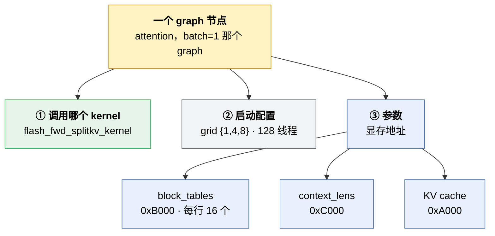
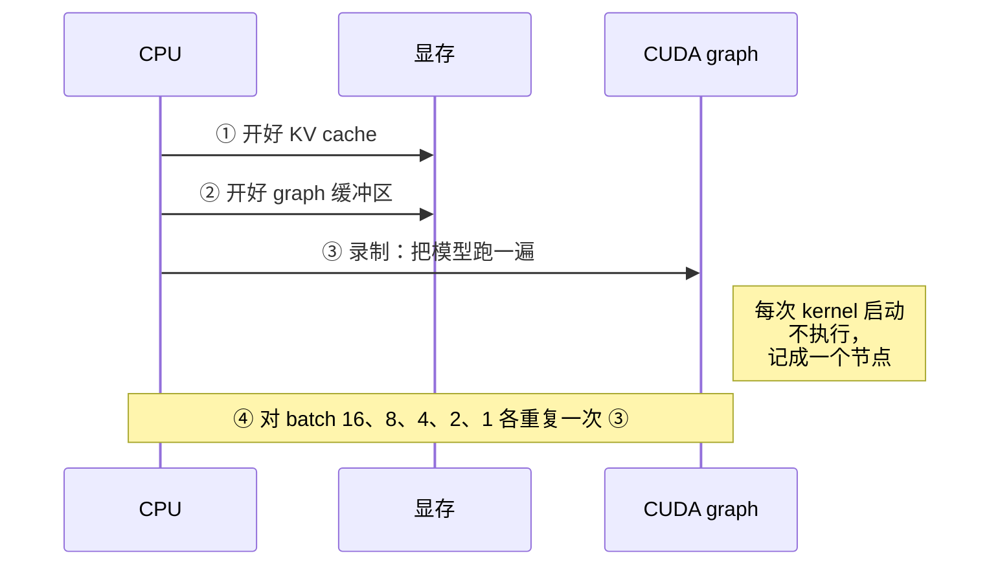
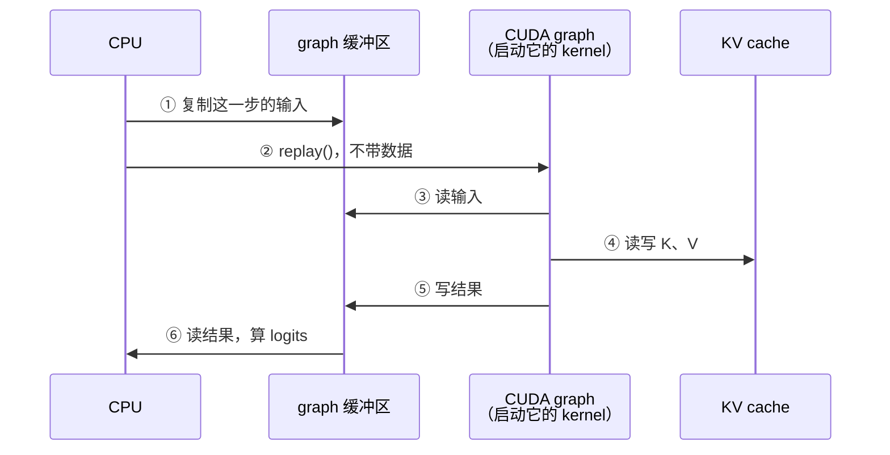

# nano-vllm 问答：CUDA graph

读 nano-vllm [#190](https://github.com/GeeeekExplorer/nano-vllm/issues/190) 时我问过的问题和答案，用中文写，方便自己复习；英文的整理版见 [#190 write-up](issues/190-cuda-graph-block-tables.md)。代码都对应 upstream [`bb823b3`](https://github.com/GeeeekExplorer/nano-vllm/tree/bb823b3e06983d71485a8e1f23715ebd87d98ef8)。2026-10-05 整理，之后陆续补充。

全文用同一个例子：这一步 decode 的 batch 里有 3 个序列，A 有 600 个 token，B 有 300 个，C 有 100 个。一个 KV block 放 256 个 token。

**目录**（由浅入深）

1. 一句话：这个 bug 是什么
2. 缓冲区：是什么、为什么需要、为什么会有 #190、第 210 行在做什么
3. decode 是怎么算的：一批序列一起算、补 -1、长度不同为什么不会对不齐、开销和负载不均衡
4. CUDA graph：干嘛的、为什么每个 batch size 录一个、录下来的 graph 实测长什么样、和 block 数的关系、怎么导出来看
5. GPU kernel：kernel 和 graph 的区别 → GPU 基本单位 → 矩阵乘 kernel 代码 → 为什么慢、怎么变快 → Triton 和 torch.compile 生成的 kernel → 为什么要写这么多种、怎么选、谁来写 → 读懂导出的节点和启动配置
6. 把缓冲区、CUDA graph 和 kernel 串起来：结构、时间、缓冲区表、四类显存、三种位置信息、空座位算什么
7. 代码在哪里：一步 decode 的执行路线
8. 其他
9. 自测：做过的题和纠正
10. 下一步要想的问题

## 一句话：这个 bug 是什么

CUDA graph 录制时准备的 `block_tables` 缓冲区只有 `max_model_len / 256` = 16 列，而且以后不能改；可是没有任何代码限制序列长度。序列长到 4097 个 token 时需要 17 列，回放前往缓冲区里复制数据就报错：

```
The expanded size of the tensor (16) must match the existing size (17)
Target sizes: [32, 16]. Tensor sizes: [32, 17]
```

意思是：这一批有 32 个序列；缓冲区每行只有 16 格，这一步的表却有 17 列。

---

## 缓冲区

### 缓冲区是什么？

提前在 GPU 上开好、之后反复使用的一块内存。在 nano-vllm 里，就是 `capture_cudagraph` 启动时建的那几个张量（[model_runner.py 第 227-233 行](https://github.com/GeeeekExplorer/nano-vllm/blob/bb823b3e06983d71485a8e1f23715ebd87d98ef8/nanovllm/engine/model_runner.py#L227)）：

```python
block_tables = torch.zeros(512, 16, dtype=torch.int32)   # 只建这一次，以后一直用它
```

### 为什么需要它？

因为 CUDA graph 录下的不是“某个变量”，而是**一个固定的内存地址**：

```
eager（不用 CUDA graph），每一步：
  bt = 新建一个张量 [[5, 9, 12], [7, 3, -1]]    ← 每次都是新的，放在不同的内存地址
  attention(..., block_table=bt)                 ← 拿到什么就读什么

CUDA graph：
  启动时：buf = torch.zeros(512, 16)             ← 只建一次，假设放在地址 X
          录制 attention(..., block_table=buf)    ← graph 记下：“去地址 X 读，每行 16 个数”
  每一步：buf[:2, :3] = 这一步的表               ← 把这一步的数据搬到地址 X
          graph.replay()                          ← 去地址 X 读
```

比方：缓冲区是一张**事先印好的表格**，每行 16 个格子。录 graph 就是训练一台机器“每次都去这张表的这个位置读”。以后只能往这张表里填新内容，不能换一张。

### 为什么会有 #190？

三件事叠在一起：

1. 表格的大小在启动时就定了：每行 16 格（按 `max_model_len = 4096` 算）
2. 表格不能换：机器只认这一张
3. 没有任何代码限制序列长度

序列长到 4097、需要第 17 个 block → 往 16 格里填 17 个数 → 报错。eager 模式没有固定的表，每一步按需新建，多宽都行，所以不出错。

### 缓冲区 `block_tables` 长什么样？每行是什么意思？

512 行 × 16 列，录制时全是 0（只是占位，录 graph 只关心形状和地址）：

```
          第1个block 第2个 第3个 ... 第16个
座位 0    [   0       0     0   ...    0  ]
座位 1    [   0       0     0   ...    0  ]
...
座位 511  [   0       0     0   ...    0  ]
```

- 每一行是一个“座位”：这一批里的第 i 个序列坐第 i 行，最多 512 个
- 每一列放这个序列的一个 block 编号：最多 16 个 block = 4096 个 token

### 第 210 行具体在做什么？

```python
graph_vars["block_tables"][:bs, :context.block_tables.size(1)] = context.block_tables
```

把这一步那张小表复制到缓冲区的**左上角**。用 A、B、C 走一遍：`bs = 3`，表是 3 行 3 列；没有录 batch 3 的 graph，所以用 batch 4 的（第 202 行）：

```
          第1个 第2个 第3个 第4个 ... 第16个
座位 0    [ 5     9    12     ?   ...   ?  ]   ← A
座位 1    [ 7     3    -1     ?   ...   ?  ]   ← B
座位 2    [ 4    -1    -1     ?   ...   ?  ]   ← C
座位 3    [ ?     ?     ?     ?   ...   ?  ]   ← 空座位（batch 4 的 graph 多出来的一行）
```

`?` 是之前留下的旧数据。空座位的 `context_lens` 被设成 0（第 208-209 行），attention 不会读它。前面第 204-209 行对 `input_ids`、`positions`、`slot_mapping`、`context_lens` 做同样的事。全部倒完，第 211 行 `graph.replay()`。

### 为什么不能临时换一块更宽的？

因为是固定的：录好的 attention kernel 记的是旧缓冲区的**地址和每行宽度**。新张量在别的地址，录好的操作根本看不到它。想换宽度只能重新录 graph，一次要好几秒，不可能每步都录。

---

## decode 是怎么算的

### 一个序列不是单独处理的吗？为什么要用最长的那行来补齐？

一批序列是**一起算**的：每一层的每个 GPU 操作只调用一次，同时处理 A、B、C。GPU 张量必须是矩形（每行一样长），所以短的行要补到和最长的一样宽：

```
block_tables =            context_lens =
[[5,  9, 12],    ← A      [600,
 [7,  3, -1],    ← B       300,
 [4, -1, -1]]    ← C       100]
```

### 补 -1 影响计算吗？占空间吗？费算力吗？

都不：

- **计算**：attention 处理 B 那一行时，先看 `context_lens` 是 300，只读 2 个 block（300 ÷ 256 向上取整），读完 `7, 3` 就停，`-1` 永远不会被读
- **空间**：每格 4 字节。整个缓冲区 512 × 16 × 4 = 32 KB；一个 KV block 约 28 MB（2 × 28 层 × 256 个 token × 8 个头 × 128 维 × 2 字节）

### 为什么偏偏是 -1？

它不是合法的 block 编号，一看就知道“这里是空的”；万一有 bug 读到了，也更容易发现。反正永远不会被读，填什么都行。

### 长度不同、要取的 token 位置也不同，不会对不齐吗？

不会。decode 时每个序列**只送 1 个 token**，所以天然对齐：

```
input_ids    = [A 的最后一个 token, B 的, C 的]     ← 一人一个，规整
positions    = [599, 299, 99]                       ← 各自的位置，位置编码按它算
slot_mapping = [12×256+87, 3×256+43, 4×256+99]      ← 各自的新 K/V 写到 KV cache 哪一格
context_lens = [600, 300, 100]                      ← 各自的历史有多长
block_tables = [[5, 9, 12], [7, 3, -1], [4, -1, -1]] ← 各自的历史在哪些 block
```

- 矩阵乘、norm、MLP：输入是 3 行 × 1024，每行一个序列，各算各的
- attention：唯一要看历史的地方，按 `context_lens` 和 `block_tables` 各读各的

长度不同这件事，全部交给 `context_lens` + `block_tables` 在 attention 里处理。

（prefill 是另一种做法：几个序列的 token 首尾相接拼成一长串，不补齐，用 `cu_seqlens` 标出每个序列从哪开始。）

### 每次 decode 都要重新拼张量，不浪费吗？每次都要重新判断吗？

- **确实是开销**：`prepare_decode` 每一步都在 CPU 上用 Python 循环遍历所有序列、拼列表、转张量、拷到 GPU。这就是上游的 #175（PR #176、#253 在解决）
- **调度必须每步做**：batch 每一步都在变，有的序列结束、有新序列加入、有的被抢占（continuous batching）；每个序列也长了 1 个 token，可能需要新 block
- **成熟引擎的优化**：只更新变化的部分（vLLM 的常驻输入缓冲区）；CPU 准备下一步的同时 GPU 算这一步（SGLang 的 overlap scheduling）

### 一个超长、其他都很短，补 -1 不浪费吗？能不能分开算？

- `-1` 不浪费（不会被读）
- 真正的问题是**负载不均衡**：短的很快算完，GPU 在等长的那个
- “把长的拆开”就是业界的 **Flash-Decoding（split-KV）**：把长序列的历史切成几段并行算，最后合并。flash-attn 的 `flash_attn_with_kvcache` 有参数 `num_splits`，默认 0 = 自动决定切几段
- “把短的单独拿出来”在训练里常见（按长度分桶），推理时 attention 本来就不补零，分开算反而多调用几次 kernel
- nano-vllm 里真正的补齐浪费在别处：batch 要补到录过的大小（17 个序列按 32 个跑，多出的 15 个空座位在矩阵乘里也会被算）

---

## CUDA graph

### CUDA graph 到底是干嘛的？不是每一步都要做吗？

每一步都要**算**模型，但不一定要用 graph。graph 不改变算什么，只改变“怎么把活派给 GPU”：

```
eager：      Python 一个一个发 GPU 操作，batch=1 时一次 decode 395 个（每层 14 个 × 28 层，再加几个；实测见下面）。
             每个操作计算量很小（每个序列 1 个 token），GPU 大部分时间在等 CPU 发下一个
CUDA graph： 启动时把这几百个操作连同读写的内存地址录下来，
             以后每步一句 graph.replay()，GPU 一口气跑完
```

比方：eager 是厨师每做一步都要等服务员来说下一步；graph 是事先写好一张固定菜谱，以后只说“照菜谱做”。代价：菜谱写死了“食材放哪个盘子、盘子多大” → 这就是缓冲区。

- **只有 decode 用**：decode 一步很小、要重复成千上万次，发命令的开销占大头；prefill 计算量大、每次 token 数都不一样
- **超过 512 个序列不用**：启动时没录这么大的
- **`example.py` 写的是 `enforce_eager=True`**：平时跑它根本没用到 CUDA graph，也碰不到这个 bug
- `compute_logits`（算词表概率）不在 graph 里，回放之后单独用 eager 跑（第 212 行）

### 为什么每个 batch size 都要录一遍？

每个操作的形状都录死了（比如 qkv 矩阵乘记的是“输入 4 行”），一个 graph 只能用于一种 batch size。不可能 1 到 512 都录，所以只录 36 种：1、2、4、8、16、32、48……512（第 234 行）。运行时找“不小于当前 batch 的最小那个”（第 202 行），多出来的是空座位。

录的顺序从大到小，所有 graph 共用一块内存池（`self.graph_pool`）：最大的先把池子撑够，小的直接复用。

### 录下来的 graph 长什么样？

一张 GPU 操作清单，每项记着调用哪个 kernel、读写哪块内存、开多少线程。存在显卡驱动里，PyTorch 只给一个看不到内部的对象。batch = 4 的大概是：

```
#1    embedding      读 input_ids[0:4]              写 临时区 1
#2    rmsnorm        读 临时区 1                    写 临时区 2
#3    qkv 矩阵乘     读 临时区 2（4 行 × 1024）      写 临时区 3
#4    rotary         读 positions[0:4]、临时区 3     ...
#5    store_kvcache  读 slot_mapping[0:4]            写 KV cache
#6    attention      读 block_tables[0:4]、context_lens[0:4]、KV cache
...   （28 层；这张是跑之前猜的示意，实测是每层 14 个、一共 395 项，见下一节）
#末   最后的 norm    写 outputs[0:4]
```

想亲眼看：录制前调用 `graph.enable_debug_mode()`，录完调用 `graph.debug_dump("x.dot")`，就能导出来（见下面“怎么把 graph 导出来看”）。

### 录下来的 graph 实际长什么样？（2026-10-05 跑出来的）

上面那张是跑之前猜的，下面是实测（导出 nano-vllm 自己录的 graph，`max_num_seqs=16`，所以录了 batch 1、2、4、8、16 五个）：

**小例子** `y.copy_((x @ w).relu() + 1)` → 4 个节点：矩阵乘 `gemmSN_NN_kernel`、relu（PyTorch 用 `clamp` 实现）、`+ 1`、最后 `copy_` 是一次显存拷贝（MEMCPY）。每一步都是单独的 GPU 操作。

**nano-vllm，batch=1：395 个节点**。embedding 之后，每层都是同样的 14 个 kernel：

| 层内第几个 | kernel | 对应哪一步 |
|---|---|---|
| 1 | `triton_per_fused_..._rsqrt` | input_layernorm（RMSNorm，torch.compile 合成了一个 kernel） |
| 2 | `gemvx` | qkv 投影（只有 1 个 token，是矩阵乘向量） |
| 3、4 | `triton_per_fused_..._rsqrt` | q_norm（grid 16 = 16 个 q 头）、k_norm（grid 8 = 8 个 kv 头） |
| 5、6 | `triton_poi_fused_..._cat` | 位置编码，分别作用在 q 和 k 上 |
| 7 | `store_kvcache_kernel` | 新 token 的 K/V 写进 KV cache（之前读过的那个 Triton kernel） |
| 8、9 | `flash_fwd_splitkv` + `combine` | attention：切成 4 段并行算，再合并 |
| 10 | `gemvx` | o 投影 |
| 11 | `triton_per_fused_..._rsqrt` | post_attention_layernorm（顺便加 residual） |
| 12 | `cutlass::Kernel2` | gate_up 投影 |
| 13 | `triton_poi_fused_mul_silu` | SiluAndMul |
| 14 | `gemvx` | down 投影 |

数量对得上：28 层 × 14 = 392，加 embedding、最后的 norm = 394 个 kernel，再加 1 个把结果拷进 `outputs` 缓冲区的 MEMCPY = 395。RMSNorm 那个 kernel 113 次 = 28 × 4 + 1，`gemvx` 84 次 = 28 × 3。

**batch=16：367 个节点，而且 kernel 都换了**，不只是启动配置变大：

| | batch=1 | batch=16 |
|---|---|---|
| 矩阵乘 | `gemvx`（矩阵 × 向量） | `cutlass::Kernel2`（矩阵 × 矩阵） |
| attention | grid `{1,4,8}`：切 4 段 × 8 个 kv 头，再加一个 combine | grid `{1,16,8}`：16 个序列 × 8 个 kv 头，不切，没有 combine |
| q_norm、k_norm | `triton_per_...` | `triton_red_...`（另一种归约写法） |
| 其他 kernel 的 grid | 1、8、12 | 16、128、192 |

少的 28 个节点就是每层那个 combine kernel：395 − 28 = 367。

**结论**：

- 一个 graph 只能用于一种 batch size——不光形状，**连选哪个 kernel 都跟着 batch size 变**，所以每个 batch size 都要单独录
- attention 切段就是 Flash-Decoding（split-KV），flash-attn 自动决定：batch=1 只有 8 份活（每个 kv 头一份），填不满 GPU，所以每份切成 4 段；batch=16 活够多，不切。**切几段也被录死在 graph 里了**

### CUDA graph 和 block 数有关，还是只和 batch size 有关？

两者都有关，方式不同：**batch size 决定录几个 graph；block 相关的东西，一部分录死了，一部分只是每步往缓冲区里填的数据。**

| 东西 | 录 graph 时写死了吗？ | 运行时能变吗？ |
|---|---|---|
| batch size | 是：每种一个 graph | 只能用录过的几种，不够就补空座位 |
| 每个序列**最多**几个 block（缓冲区宽度 = `max_model_len / 256` = 16 列） | 是 | **不能** → 超过就是 #190 |
| 每个序列**实际**用几个 block、用哪几个 | 否，是缓冲区里的数据 | 每步都变，没问题 |
| 序列实际长度（`context_lens`） | 否，是数据 | 每步都变，没问题 |
| KV cache 一共多少个 block（`num_kvcache_blocks`） | KV cache 的**内存地址**被录进去了 | 启动后不再变，所以没问题 |
| attention 切几段（`{1,4,8}` 里的 4） | 是，在启动配置里 | 不能，序列很短也照样切 4 段 |

- **KV cache 为什么不怕被录死**：`ModelRunner.__init__` 的顺序是 warmup → `allocate_kv_cache()` → `capture_cudagraph()`。录的时候 KV cache 已经在固定地址上，之后大小也不变。反过来，如果运行中要重新分配 KV cache，所有 graph 都得重录
- **“最多几个”和“实际几个”是两回事**：录死的只是表格宽度（16 格）；实际用 3 个 block 就填 3 格，剩下的不读
- **切几段可能也和 block 数有关**（根据对 flash-attn 源码的理解推的，没验证）：分页 KV cache 下，flash-attn 在 CPU 上看不到每个序列的实际长度，可能按“表格宽度 × 256”（也就是 `max_model_len`）估算长度来决定切几段。验证方法：我导出 graph 时用的是 `max_model_len=1024`，换成 `4096` 再导一次，看 batch=1 时 attention 的 grid 还是不是 `{1,4,8}`

### 怎么把 graph 导出来看？

nano-vllm 录 graph 时没开调试模式。我的做法：在启动 nano-vllm 之前，把 `torch.cuda.CUDAGraph` 换成一个“一创建就调用 `enable_debug_mode()`”的子类（nano-vllm 的代码一行不改，`capture_cudagraph` 里的 `torch.cuda.CUDAGraph()` 会用到这个替身），启动后对想看的 batch size 调 `llm.model_runner.graphs[bs].debug_dump("graph_bs1.dot")`。

导出的 `.dot` 文件三种看法：

1. **直接打开**：纯文本，搜 `flash_fwd`、`cutlass` 就能跳到 attention 和矩阵乘。细节多
2. **写个小脚本解析成表格**：挑出每个节点的类型、kernel 名字和启动配置，再把 C++ 改编过的名字还原（见下面第 12 节）
3. **画成图**：用 Graphviz。nano-vllm 的 graph 是三四百个节点的长链，画出来不好看，适合看小例子

小发现：batch=1 是 395 个节点、394 条边，batch=16 是 367 个节点、366 条边——**整个 graph 是一条直线**，每个 kernel 都等前一个做完，没有并行的分支。

### .dot 文件是 CUDA graph 本来的样子，还是脚本加的？

都不是。**文件内容全是 CUDA 自己生成的**，但 CUDA graph 平时根本不存成文件，它只在显卡驱动的内存里，有两种形态：

| 形态 | 是什么 | 能打印吗 |
|---|---|---|
| `cudaGraph_t`（描述） | “节点 + 边”的清单：有哪些操作、谁依赖谁 | 能 |
| `cudaGraphExec_t`（可执行版） | 驱动按清单编译好的版本，`replay()` 跑的就是它 | 不能，内部格式 |

PyTorch 录完后为了省内存，会删掉“描述”那份。所以要：

1. `enable_debug_mode()`：录完先别删描述
2. `debug_dump("x.dot")`：PyTorch 调 NVIDIA 官方的 `cudaGraphDebugDotPrint`，由 CUDA 驱动把描述写成 Graphviz 的 `.dot` 格式（终端里出现过 `DEBUG: calling cudaGraphDebugDotPrint() ...` 这行提示）

我写的解析脚本只是读这个文件：挑出类型、名字、启动配置，把改编过的 kernel 名字还原（比如 `vectorized_elementwise_kernel (add)` 里括号中的 `add`，是从模板参数里猜出来的提示）。文件内容本身全是 CUDA 生成的。

---

## GPU kernel：graph 里的每个节点到底是什么

看了录下来的 graph 之后的追问。按顺序读：先分清概念 → GPU 的基本单位 → kernel 代码长什么样 → 为什么慢、怎么变快 → 为什么要写这么多种 → 怎么选、谁来写 → 回头读懂 .dot 文件和 graph 里的 kernel。

### 1. 先分清：kernel 和 CUDA graph

我一开始以为 kernel 是“提前安排好的 SOP，先跑一遍、告诉 GPU 从哪读，自己不负责执行”——**这说的其实是 CUDA graph**。

| | 是什么 | 比喻 |
|---|---|---|
| **kernel** | **真正在 GPU 上执行的代码**，一个函数。成千上万个线程同时跑同一份代码，各自处理一小块数据 | 一道工序的具体做法（“菜怎么切”），工人真的动手做 |
| **CUDA graph** | 把“按什么顺序调用哪些 kernel、各用什么参数和地址”录成一张清单，以后一次性照着跑 | SOP 清单：“第 1 步切菜，第 2 步炒菜……” |

batch=1 的 graph 里有 395 个节点，每个节点 = “用某组参数调用一次某个 kernel”。

### 2. GPU 的基本单位

kernel 启动时要说明派多少人干活，写法是 `kernel<<<grid, block, shared_mem>>>(参数)`：

| 单位 | 是什么 |
|---|---|
| **thread（线程）** | 干活的最小单位 |
| **warp** | 32 个线程一组，同一时刻执行同一条指令 |
| **block（线程块）** | 一组线程（最多 1024 个），在同一个 SM 上跑，共用一块 **shared memory**（片上高速内存），能互相同步 |
| **grid** | 这一次启动的全部 block。grid 和 block 都可以是 1、2、3 维（比如 `{1,4,8}`） |
| **SM** | GPU 的“车间”。我的 RTX 4060 笔记本卡有 24 个。block 被分配到车间里，不够就排队 |

比方：kernel = 一张订单；grid = 订单拆出来的所有小组；block = 一个小组，进一个车间；thread = 组里的工人；shared memory = 小组的工作台。

### 3. kernel 代码长什么样：最朴素的矩阵乘

**核心思想：所有线程跑同一份代码，唯一的区别是每个线程知道“我是第几个”**，据此处理属于自己的那块数据。

```cuda
// C = A × B，A 是 M×K，B 是 K×N，C 是 M×N
__global__ void matmul(const float* A, const float* B, float* C, int M, int N, int K) {
    int row = blockIdx.y * blockDim.y + threadIdx.y;   // 我负责 C 的第几行
    int col = blockIdx.x * blockDim.x + threadIdx.x;   // 我负责 C 的第几列
    if (row < M && col < N) {                          // 越界的线程什么也不做
        float sum = 0.0f;
        for (int k = 0; k < K; ++k)
            sum += A[row * K + k] * B[k * N + col];    // A 的一行 · B 的一列
        C[row * N + col] = sum;                        // 每个线程只算 C 里的 1 个数
    }
}

// CPU 这边启动：每个 block 16×16 = 256 个线程，grid 正好盖住整个 C
dim3 block(16, 16);
dim3 grid((N + 15) / 16, (M + 15) / 16);
matmul<<<grid, block>>>(A, B, C, M, N, K);
```

`blockIdx`（我在第几个 block）、`threadIdx`（block 里第几个线程）、`blockDim`（block 多大）是 GPU 自动给每个线程的。`<<<grid, block>>>` 就是 .dot 文件里看到的启动配置。

**走一遍**（M = N = 32）：

- grid = 2 × 2 = 4 个 block，每个 256 个线程，一共 1024 个线程 = C 的 1024 个数
- block (1, 0) 里的线程 (3, 5)：`row = 0×16 + 5 = 5`，`col = 1×16 + 3 = 19` → 负责 `C[5][19]`
- 1024 个线程同时跑这段代码，各算各的

### 4. 为什么这样写很慢

每个线程都从显存读 A 的一整行和 B 的一整列，同一行 A 被一整排线程重复读很多遍。**GPU 算得极快，但从显存搬数据慢得多**，这个写法大部分时间在等数据。

### 5. 怎么变快：分块（tiling）+ shared memory

一个 block 先把 A、B 各一块 16×16 搬到 shared memory（工作台），256 个线程从工作台上反复取用，用完换下一块：

```cuda
__shared__ float As[16][16], Bs[16][16];          // 这个 block 的工作台
for (int t = 0; t < K; t += 16) {
    As[ty][tx] = A[row * K + t + tx];             // 每个线程搬 1 个数，256 个线程合力搬一整块
    Bs[ty][tx] = B[(t + ty) * N + col];
    __syncthreads();                               // 等大家都搬完
    for (int k = 0; k < 16; ++k) sum += As[ty][k] * Bs[k][tx];   // 从工作台读，很快
    __syncthreads();
}
```

每个数从显存只搬一次，在工作台上被用 16 次。cuBLAS 在此基础上还会：把数据放进寄存器、用 Tensor Core 专用指令、算这一块时预取下一块、针对每一代显卡单独调参数……

**差距有多大**：一篇很有名的博客（Simon Boehm，“How to Optimize a CUDA Matmul Kernel for cuBLAS-like Performance”，A6000 上）大约是：

| 写法 | 速度（相对 cuBLAS） |
|---|---|
| 朴素写法 | 约 1% |
| 加 shared memory 分块 | 约 13% |
| 一路优化到最后 | 约 94% |

**同一个计算，写法不同能差几十倍。**

### 6. 另一种写法：Triton（按 block 写）

Triton 让你“按 block 写”，每个线程具体干什么交给编译器安排。nano-vllm 自己写的 [store_kvcache_kernel](https://github.com/GeeeekExplorer/nano-vllm/blob/bb823b3e06983d71485a8e1f23715ebd87d98ef8/nanovllm/layers/attention.py#L11)：

```python
@triton.jit
def store_kvcache_kernel(key_ptr, key_stride, value_ptr, value_stride, k_cache_ptr, v_cache_ptr, slot_mapping_ptr, D):
    idx = tl.program_id(0)                        # 我是第几个 program（= 第几个 block）→ 负责第几个 token
    slot = tl.load(slot_mapping_ptr + idx)        # 这个 token 写到 KV cache 的哪一格
    if slot == -1: return                         # 空座位：什么也不做
    key = tl.load(key_ptr + idx * key_stride + tl.arange(0, D))   # 一次读这个 token 的整行 K（D 个数）
    ...
    tl.store(k_cache_ptr + slot * D + tl.arange(0, D), key)       # 写进 KV cache

store_kvcache_kernel[(N,)](...)                   # 启动 N 个 program：一个 token 一个
```

所以 graph 里它是 `<<<1,128,0>>>`（batch=1）和 `<<<16,128,0>>>`（batch=16）：grid 就是 token 数；128 是 Triton 默认的 4 个 warp。

### 7. torch.compile 自动生成的 kernel：graph 里的 RMSNorm

`triton_per_fused_..._rsqrt` 是 `torch.compile` 启动时**自动生成**的，代码在 torch.compile 的缓存目录（Windows 上是 `%TEMP%\torchinductor_<用户名>\`）下的 .py 文件里。我找到的一份（`add_rms_forward` 那一版，删了几行、加了注释）：

```python
def triton_per_fused__to_copy_add_mean_mul_pow_rsqrt_0(in_ptr0, in_ptr1, in_ptr2, out_ptr1, out_ptr2, ...):
    x0 = tl.program_id(0)                       # 我负责第几行（第几个 token）
    r1 = tl.arange(0, 1024)                     # 一次处理整行 1024 个数（per = 整行放进一个 block）
    tmp0 = tl.load(in_ptr0 + (r1 + 1024*x0))    # x
    tmp2 = tl.load(in_ptr1 + (r1 + 1024*x0))    # residual
    tmp16 = tl.load(in_ptr2 + r1)               # weight
    tmp4 = tmp0 + tmp2                          # x + residual
    tmp8 = tl.sum(tmp4 * tmp4, 0)               # 平方和
    tmp13 = libdevice.rsqrt(tmp8 / 1024.0 + 1e-06)   # 1 / sqrt(平方的平均 + eps)
    tmp17 = tmp4 * tmp13 * tmp16                # 归一化，再乘 weight
```

对照 [layernorm.py 的 `add_rms_forward`](https://github.com/GeeeekExplorer/nano-vllm/blob/bb823b3e06983d71485a8e1f23715ebd87d98ef8/nanovllm/layers/layernorm.py#L28)，每步都对得上。eager 模式下这是好几个 kernel、每步都把中间结果写回显存；合成一个后，数据读一遍就算完。

想看任何一个生成的 kernel：运行前 `set TORCH_LOGS=output_code`，或者在缓存文件夹里搜它的名字。

### 8. 为什么每种计算都要单独写一个 kernel？

因为 GPU 的瓶颈通常是**搬数据**，而最优的搬法因计算而异：

- **不同计算，数据复用方式不同**：矩阵乘的数据能反复用；逐元素运算每个数只用一次；归约要先把一行汇总到一起 → 分工方式完全不同
- **同一计算，形状不同，最优写法也不同**：我的 graph 里 batch=1 用 `gemvx`（矩阵 × 向量），batch=16 换成 `cutlass`（矩阵 × 矩阵）
- **合并能少搬数据**：上面 RMSNorm 的例子
- **不同代显卡不一样**：Tensor Core、shared memory 大小都不同，所以 cuBLAS 里装着上百个 kernel，每代一套

### 9. 有没有默认的 kernel？

没有万能的，但有三种兜底：

- **通用模板**：PyTorch 所有逐元素运算（加、乘、clamp……）共用一个模板 `vectorized_elementwise_kernel`，只换里面的运算。小例子里看到的就是它
- **慢但一定能用的后备**：比如 PyTorch 的 `scaled_dot_product_attention` 依次试 FlashAttention → memory-efficient → “math”（普通矩阵乘 + softmax，最慢但什么情况都能跑）
- **现场生成**：Triton / `torch.compile` 针对具体组合当场写一个新 kernel。graph 里那些 `triton_..._fused_...` 都是启动时生成的

一个运算在 GPU 上一个实现都没有时，会直接报错：`"xxx" not implemented for 'CUDA'`。

### 10. 有好几个候选的 kernel，怎么选？

1. **按规则（heuristics）**：看形状、数据类型、显卡型号直接决定。cuBLAS 看到只有 1 行就用 gemv；flash-attn 看活不够多就切段；`torch.compile` 按一行的大小选 `per` 还是 `red`。我的 batch=1 vs batch=16 对比全是这种
2. **实测（autotuning）**：把候选都跑一遍计时，留最快的并缓存。如 Triton 的 `@triton.autotune`、`torch.compile(mode="max-autotune")`
3. **按设备和类型分发（dispatch）**：PyTorch 按张量在 CPU/GPU、fp32/bf16 找对应实现

引擎开发者也可以自己指定：nano-vllm 直接调 `flash_attn_with_kvcache`，不让 PyTorch 选。

### 11. 谁来写 kernel？去哪找？

看名字前缀就能找到出处：

| graph 里的名字 | 谁写的 | 代码在哪 |
|---|---|---|
| `at::native::...` | PyTorch 开发者 | PyTorch 仓库 `aten/src/ATen/native/cuda/`。名字里带着文件名：`..._Indexing_cu_...` → `Indexing.cu`，`TensorCompare_cu` → `TensorCompare.cu` |
| `gemvx`、`gemmSN_...`、`cutlass::Kernel2` | NVIDIA | cuBLAS 不开源（二进制）；它用的 CUTLASS 开源：[NVIDIA/cutlass](https://github.com/NVIDIA/cutlass) |
| `flash::...` | Tri Dao 等 | [Dao-AILab/flash-attention](https://github.com/Dao-AILab/flash-attention) 的 `csrc/flash_attn/src/` |
| `triton_poi/red/per_fused_...` | `torch.compile` 自动生成 | torch.compile 的缓存目录，或运行前设环境变量 `TORCH_LOGS=output_code` |
| `store_kvcache_kernel` | nano-vllm 作者 | `nanovllm/layers/attention.py` |

vLLM 有自己的 `csrc/`，SGLang 有 `sgl-kernel`。写和调 kernel 就是 AI Infra 里很重要的一块，也是 roadmap Phase 3 的内容（GPU-Puzzles、Triton-Puzzles → 用 Triton 写矩阵乘、FlashAttention）。

### 12. 回头读懂 .dot 文件里的一个节点

```
digraph dot {                                   ← Graphviz 有向图，整个文件是一张图
subgraph cluster_1 {                            ← 一个 CUDA graph，画出来是虚线框
"graph_1_node_0"[style="bold" shape="record"    ← 一个节点 = 一个 GPU 操作；style、shape 只管画图样式
  label="{KERNEL                                ← 节点类型
| {ID | 0 (topoId: 3) | <kernel 名字>\<\<\<1,256,0\>\>\>}
| {{node handle | func handle} | {0x... | 0x...}}
| {accessPolicyWindow | ... | {0x0 | 0 | 0.000000 | N | N}}
| {cooperative | 0}
| {priority | 0}
| {cluster dim | (0,0,0)} ...
```

| 字段 | 意思 |
|---|---|
| `KERNEL` | 节点类型。其他：`MEMCPY`（显存拷贝）、`MEMSET`（填数）、`HOST`（回调 CPU 函数）、`EVENT`、子 graph 等 |
| `ID` | 录制顺序（看这个就行）；`topoId` 是 CUDA 内部拓扑排序编号，这里正好倒着数 |
| kernel 名字 | C++ 改编过的函数名，见下 |
| `<<<1,256,0>>>` | **启动配置**：1 个 block × 每个 256 个线程，额外 0 字节 shared memory |
| `node handle`、`func handle` | CUDA 内部指针，每次运行都不同，不用管 |
| `accessPolicyWindow` | L2 缓存提示（让某段内存尽量留在 L2），全 0 = 没用 |
| `cooperative` | 是否“协作式启动”（所有 block 能在 kernel 中途一起同步），0 = 普通 |
| `priority` | 调度优先级，0 = 默认 |
| `cluster ...` | Hopper（H100）才有的“线程块簇”，0 = 没用；4060 是 Ada 架构，本来也没有 |

**kernel 名字怎么读**（C++ mangling）：

```
_Z 16gemmSN_NN_kernel I f Li256E Li4E ... Lb0E ... E
│  │                 │ │ └─ L i 256 E = 整数 256      └─ Lb0E = 布尔 false
│  │                 │ └─ f = float
│  │                 └─ I ... E 之间是模板参数
│  └─ 16 个字符的名字
└─ “这是改编过的 C++ 名字”
```

→ `gemmSN_NN_kernel<float, 256, 4, 2, 8, 4, 4, false, ...>`：cuBLAS 处理“N 很小”的矩阵乘（`NN` = 两个矩阵都不转置），256、4 这些是编译时定好的调优参数。

**其他两种内容**：

- `MEMCPY ... DtoD ... {Width | 128}`：显存到显存拷 128 字节（y 是 4×8 个 fp32 = 32 × 4 字节）
- `"graph_1_node_0" -> "graph_1_node_1"`：边，node_1 要等 node_0 做完

### 13. graph 里常见 kernel 的启动配置怎么读

方法：**看前缀知道来自哪个库，看启动配置推出每个 block 负责什么。**

| kernel | 启动配置 | 每个 block 负责什么 |
|---|---|---|
| `gemvx`（qkv 投影，batch=1） | `<<<1024,{16,4},272>>>` | 输出 4096 个数；1024 个 block，每个 16×4 = 64 线程。大概每个 block 算 4 个输出、每个输出由 16 个线程分头把 1024 个乘积加起来 |
| `cutlass::Kernel2`（qkv，batch=16） | `<<<{8,32},32,8704>>>` | 输出切成 8×32 块，用 shared memory 当工作台 |
| `vectorized_elementwise_kernel<4, …>` | `<<<1,128,0>>>` | 小例子一共 32 个数，1 个 block 够了；`4` = 每个线程一次读写 4 个数 |
| `triton_per_fused_..._rsqrt`（RMSNorm） | `<<<1,256,32>>>` | 1 个 token = 1 行 = 1 个 block（batch=16 → 16 个）；256 线程 = 8 个 warp；32 字节 shared memory 大概是 8 个 warp 各存一个部分和（8 × 4 字节） |
| `indexSelectSmallIndex`（embedding） | `<<<8,128,0>>>` | 从词表矩阵里取出这个 token 的那一行 |
| `store_kvcache_kernel` | `<<<1,128,0>>>` | 一个 token 一个 block |
| `flash_fwd_splitkv_kernel` | `<<<{1,4,8},128,81920>>>` | 1 个 query 块 × 切 4 段 × 8 个 KV 头，见下 |

**FlashAttention 那个最值得细看**。完整名字里的模板参数是 `Flash_fwd_kernel_traits<128, 64, 128, 4, …, bfloat16_t>`：head_dim 128；每个 block 负责 64 行 query；每次读进 128 个 key；4 个 warp = **128 个线程**（对上 `<<<…,128,…>>>`）。

**81920 字节 shared memory 能算出来**：Q 一块 64 × 128 × 2 字节 = 16 KB，K 一块 128 × 128 × 2 = 32 KB，V 一块 32 KB，合计 80 KB = 81920。这就是 FlashAttention 的核心：把 Q、K、V 分块搬到工作台上算，不把中间的大矩阵写回显存。后面的 `flash_fwd_splitkv_combine_kernel <<<4,128>>>` 把 4 段结果合并。

Triton 生成的 kernel 名字有规律：`triton_{poi|red|per}_fused_{合并的操作}_{编号}`

- `poi`：pointwise，逐元素（如 `triton_poi_fused_mul_silu_0` = SiluAndMul）
- `red`：reduction，数据多时分几轮循环归约
- `per`：persistent reduction，一整行放进一个 block 一次算完

graph 里没有但很常见的：softmax、LayerNorm（`vectorized_layer_norm_kernel`）、通用求和（`reduce_kernel`）、张量拷贝（`direct_copy_kernel`）、多卡通信（`ncclDevKernel_AllReduce…`，开张量并行才会出现）。

### 14. 练一练（还没做）

看 batch=16 的 graph，推一推：

- `store_kvcache_kernel <<<16,128,0>>>`：16 是什么？
- `flash_fwd_splitkv_kernel <<<{1,16,8},128,81920>>>`：中间那个 16 和 batch=1 时的 4，含义一样吗？

---

## 把缓冲区、CUDA graph 和 kernel 串起来

问题：前面那句 `block_tables = torch.zeros(512, 16, dtype=torch.int32)`，是怎么和 CUDA graph、kernel 连起来的？

**一句话**：kernel 是在 GPU 上跑的代码；CUDA graph 是录下来的一串 kernel 启动；缓冲区（比如 `block_tables`）只是显存里的一块数据。三者靠**地址**连在一起：graph 里每个节点都记着它的 kernel 要读写哪些显存地址。

### 图 A：一个 graph 节点里有什么



| 部分 | 这个节点里是什么 | 什么时候定下来 | 之后能变吗 |
|---|---|---|---|
| ① kernel | `flash_fwd_splitkv_kernel`，flash-attn 的 GPU 代码 | 录制时 | 不能 |
| ② 启动配置 | grid `{1,4,8}`（1 个 query 块 × 切 4 段 × 8 个 KV 头），每个 block 128 个线程，80 KB shared memory | 录制时 | 不能 |
| ③ 参数 | `block_tables`（每行 16 个）、`context_lens`、KV cache、前面节点算出的 `q` 的地址 | 录制时 | 不能 |
| 这些地址上的**数据** | 这一步的 block 编号、长度、已有的 K/V | — | 每一步都变 |

节点**本身不含数据、也不含代码**，只记了这三样。地址是示意；启动配置是实测的（batch=1 那个 graph 里的 attention）。地址和每行宽度在录制时就定死了，所以缓冲区不能换、也不能变宽——这就是 #190 的根。

### 图 B：启动时，录 graph



| 步 | 做了什么 | 代码 |
|---|---|---|
| ① | `allocate_kv_cache` 开一整块显存放所有层的 K、V，每层 attention 拿着其中一段，地址从此固定 | [model_runner.py L103-L121](https://github.com/GeeeekExplorer/nano-vllm/blob/bb823b3e06983d71485a8e1f23715ebd87d98ef8/nanovllm/engine/model_runner.py#L103-L121) |
| ② | `capture_cudagraph` 开好 graph 缓冲区：`input_ids`、`positions`、`slot_mapping`、`context_lens`（各 512）、`block_tables`（512 × 16）、`outputs`（512 × 1024） | [L227-L233](https://github.com/GeeeekExplorer/nano-vllm/blob/bb823b3e06983d71485a8e1f23715ebd87d98ef8/nanovllm/engine/model_runner.py#L227-L233) |
| ③ | `set_context` 让 attention 用这些缓冲区；先正常跑一遍预热，再在 `torch.cuda.graph(...)` 里跑一遍：每次 kernel 启动都不执行，而是记成一个节点 | [L240-L243](https://github.com/GeeeekExplorer/nano-vllm/blob/bb823b3e06983d71485a8e1f23715ebd87d98ef8/nanovllm/engine/model_runner.py#L240-L243) |
| ④ | 对每个 batch size 重复 ③，从大到小，所有 graph 共用一块内存池 | [L238-L246](https://github.com/GeeeekExplorer/nano-vllm/blob/bb823b3e06983d71485a8e1f23715ebd87d98ef8/nanovllm/engine/model_runner.py#L238-L246) |

### 图 C：每一步 decode，回放 graph



| 步 | 做了什么 | 代码 |
|---|---|---|
| ① | `prepare_decode` 把这一步的输入拼成新的小张量（每步地址都不一样），`run_model` 把它们复制进缓冲区的左上角，比如 3×3 的 `block_tables` 写进 512×16 的缓冲区；空座位填 `slot_mapping = -1`、`context_lens = 0` | [L204-L210](https://github.com/GeeeekExplorer/nano-vllm/blob/bb823b3e06983d71485a8e1f23715ebd87d98ef8/nanovllm/engine/model_runner.py#L204-L210) |
| ② | 选“不小于当前 batch 的最小那个” graph 来 replay，**不带任何数据** | [L202](https://github.com/GeeeekExplorer/nano-vllm/blob/bb823b3e06983d71485a8e1f23715ebd87d98ef8/nanovllm/engine/model_runner.py#L202)、[L211](https://github.com/GeeeekExplorer/nano-vllm/blob/bb823b3e06983d71485a8e1f23715ebd87d98ef8/nanovllm/engine/model_runner.py#L211) |
| ③ | 每个节点的 kernel 按录好的地址读输入：embedding 读 `input_ids`，位置编码读 `positions`，attention 读 `block_tables` 和 `context_lens` | |
| ④ | `store_kvcache` 把这一步的 K、V 写进 `slot_mapping` 指定的格子；attention 按 block 编号读历史 K、V | [attention.py L61-L74](https://github.com/GeeeekExplorer/nano-vllm/blob/bb823b3e06983d71485a8e1f23715ebd87d98ef8/nanovllm/layers/attention.py#L61-L74) |
| ⑤ | 最后一个节点把结果拷进 `outputs` | [L243](https://github.com/GeeeekExplorer/nano-vllm/blob/bb823b3e06983d71485a8e1f23715ebd87d98ef8/nanovllm/engine/model_runner.py#L243) |
| ⑥ | `compute_logits` 在 graph 外面用 eager 跑，只取 `outputs[:bs]` | [L212](https://github.com/GeeeekExplorer/nano-vllm/blob/bb823b3e06983d71485a8e1f23715ebd87d98ef8/nanovllm/engine/model_runner.py#L212) |

#190 卡在第 ① 步：表需要 17 列，可缓冲区每行只有 16 格，复制失败，replay 根本不会开始。

下面四张是同一件事的文字版，细节更多。

### 图 1：结构——谁指向谁

graph 里每个节点都是三样东西：调用哪个 kernel、启动配置、参数（显存地址）。

```
CUDA graph：graphs[1]                    （实测导出的那个；启动时录好，存在显卡驱动里；batch 1、2、4、8、16… 各一份）
 │
 ├─ 节点 #0  embedding
 ├─ 节点 #1  rmsnorm
 ├─ …
 ├─ 节点 #7  store_kvcache
 │    ├─ kernel ─────────► store_kvcache_kernel          （nano-vllm 写的 Triton 代码）
 │    ├─ 启动配置          <<<1, 128, 0>>>
 │    └─ 参数
 │         ├─ slot_mapping ──► [显存] graph 缓冲区 slot_mapping
 │         ├─ key, value ────► [显存] graph 内存池：前面节点算出的 k、v
 │         └─ k/v_cache ─────► [显存] KV cache
 │
 ├─ 节点 #8  attention
 │    ├─ kernel ─────────► flash_fwd_splitkv_kernel       （flash-attn 的 GPU 代码）
 │    ├─ 启动配置          <<<{1,4,8}, 128, 81920>>>
 │    └─ 参数
 │         ├─ block_table ───► [显存] graph 缓冲区 block_tables，每行 16 个  ← 宽度录死
 │         ├─ cache_seqlens ─► [显存] graph 缓冲区 context_lens
 │         ├─ q ─────────────► [显存] graph 内存池：前面节点算出的 q
 │         └─ k/v_cache ─────► [显存] KV cache
 ├─ …（28 层，每层 14 个节点）
 └─ 节点 #394  MEMCPY ──────► [显存] graph 缓冲区 outputs
```

- **kernel**：GPU 上跑的代码，节点只是指向它
- **启动配置**：开多少个 block、每个 block 多少线程
- **参数**：**显存地址**，kernel 运行时按这些地址读写
- **`block_tables`**：只是显存里的一块数据。它和 graph 唯一的关系：节点 #8 的参数里记着它的地址和每行宽度（16）
- `.dot` 文件里没有打印参数，但它们确实和节点一起录进去了

### 图 2：时间——启动时和每一步各发生什么

```
═══ 启动时（只做一次）══════════════════════════════════════════════════════

ModelRunner.__init__
 ├─ warmup_model()
 ├─ allocate_kv_cache()               → [显存] 开好 KV cache（地址从此固定）
 └─ capture_cudagraph()
     ├─ ① torch.zeros(512, 16) 等     → [显存] 开好 graph 缓冲区（地址从此固定）
     ├─ ② set_context(... block_tables=缓冲区 ...)   让 attention 用缓冲区
     └─ ③ 在录制状态下跑一次 model：
            每次启动 kernel → 不执行，变成 graph 里的一个节点
            （kernel + 启动配置 + 参数里的地址：缓冲区、KV cache、内存池）
            对 batch 16、8、4、2、1 各录一次 → graphs[16] … graphs[1]

═══ 每一步 decode ═══════════════════════════════════════════════════════════

Scheduler.schedule()
 │   [CPU] 每个序列：seq.block_table = [5, 9, 12]     （Python 列表）
 ▼
prepare_decode()
 │   [CPU→显存] 新建 5 个小张量：input_ids、positions、slot_mapping、
 │              context_lens、block_tables（3×3，这次的地址每步都不一样）
 ▼
run_model()
 ├─ ④ 复制：小张量 → graph 缓冲区（第 204-210 行）
 │       block_tables：3×3 写进 512×16 的左上角          ← #190：需要第 17 列时在这里报错
 ├─ ⑤ graphs[4].replay()
 │       GPU 依次启动这个 graph 的全部节点（batch=1 的是 395 个），每个节点按录下的地址读写：
 │       #7 store_kvcache：读 slot_mapping 缓冲区 → 把新 K/V 写进 KV cache
 │       #8 attention：读 block_tables、context_lens 缓冲区 → 去 KV cache 取 K/V → 算
 │       最后一个节点 MEMCPY：结果写进 outputs 缓冲区
 └─ ⑥ compute_logits(outputs[:3])                       （不在 graph 里，单独用 eager 跑）
```

**关键**：小张量每一步都是新建的，地址每次都不一样；graph 只认第 ① 步建好的缓冲区地址。所以第 ④ 步必须先把数据复制过去，第 ⑤ 步的节点才读得到。

### 图 3：显存里的所有缓冲区

| 缓冲区 | 形状 | 什么时候建 | 每一步谁写 | graph 里谁读 |
|---|---|---|---|---|
| `input_ids` | [512] | `capture_cudagraph` | CPU 复制（第 204 行） | 节点 #0 embedding |
| `positions` | [512] | 同上 | CPU 复制（第 205 行） | 每层的位置编码 |
| `slot_mapping` | [512] | 同上 | CPU 复制（第 206-207 行） | 每层的 store_kvcache |
| `context_lens` | [512] | 同上 | CPU 复制（第 208-209 行） | 每层的 attention |
| **`block_tables`** | **[512 × 16]** | 同上 | CPU 复制（**第 210 行**） | 每层的 attention |
| `outputs` | [512 × 1024] | 同上 | graph 最后的 MEMCPY | CPU 这边的 `compute_logits` |
| KV cache | 28 层 × N 块 × 256 token × 8 头 × 128 | `allocate_kv_cache`（比录 graph 早） | 每层的 store_kvcache（在 graph 里） | 每层的 attention |
| graph 内存池 | 中间结果（q、k、v、各层输出） | 录 graph 时 | graph 里的节点 | graph 里的下一个节点 |

前 6 个就是代码里的 `graph_vars`。CPU 每一步只写前 5 个、读 `outputs`；KV cache 和内存池完全由 graph 里的 kernel 自己读写。

### 用这三张图再看 #190

节点 #8 录下的是“去 `block_tables` 缓冲区读，每行 16 个”。序列需要第 17 个 block 时，这一步的表有 17 列，第 ④ 步往 16 列的缓冲区里复制就失败了——graph 还没开始跑。换一块 17 列的新张量也没用：它在别的地址，录好的节点 #8 根本不会去读。

### 图 4：graph 碰到的四类显存（自测时发现自己混了）

我一度以为“缓冲区”是所有要计算的数据（token embedding、hidden states……）。不是。graph 用到的显存分四类，**地址都在录制时固定了**，区别在于每一步谁改里面的内容：

| 类别 | 例子 | 每一步谁改内容 |
|---|---|---|
| **graph 缓冲区**（`graph_vars`） | `input_ids`、`positions`、`slot_mapping`、`context_lens`、`block_tables`、`outputs` | **CPU**（第 204-210 行写进去；`outputs` 由 CPU 读出来） |
| **中间结果**（graph 内存池） | token embedding、每层的 hidden states、q/k/v | graph 里的 kernel 自己写，下一个 kernel 读；CPU 从不碰 |
| **KV cache** | 28 层的 K、V | graph 里的 `store_kvcache` 写，attention 读 |
| **模型权重** | embedding 表、各层的矩阵 | 没人改，启动时加载好 |

“缓冲区”在这里特指 CPU 每步要填的那 5 个输入 + 1 个输出。graph 只记“去哪些地址、什么形状、调哪个 kernel”，**完全不知道里面的值**；值是 replay 时 kernel 当场读的。

### 别混：三种“位置信息”

我还以为 block_table 记的是缓冲区的地址。也不是：

```
① graph 节点的参数：显存地址（录制时固定）
     “block_tables 缓冲区在 0xB000”“KV cache 在 0xA000”
② block_tables 里的内容：KV cache 的 block 编号（每步都变的数据）
     “A 的历史存在 KV cache 的第 5、9、12 块”
③ slot_mapping 里的内容：KV cache 里的格子编号（每步都变的数据）
     “A 这一步的新 K/V 写到第 12×256+87 格”
```

`block_tables` 自己是 ① 里的一个缓冲区，里面装的是 ②。

### 空座位拿什么算？

不一定是 0。第 204 行只写 `input_ids[:bs]`，空座位保留**上一步留下的值**（最开始是录制时的 0，后来是以前某步的 token id）。所以空座位拿“旧 token、旧位置”把整个模型算一遍，得到没意义但合法的数，最后在 `outputs[bs:]` 里被扔掉（`compute_logits` 只取 `[:bs]`）。

它唯一可能有害的是**写 KV cache**（冲掉别人的历史），由 `slot_mapping = -1` 挡住。设计思路：**空座位可以算出垃圾，但不能把垃圾写到任何有用的地方。** attention 那边只读不写，空座位的 `context_lens = 0` 让它一个 block 都不读；就算读了，也只影响自己那行注定被扔掉的输出。

---

## 代码在哪里

一步 decode 按执行顺序：

| 步骤 | 代码 | 做什么 |
|---|---|---|
| 每个序列的 block 列表 | [sequence.py:28](https://github.com/GeeeekExplorer/nano-vllm/blob/bb823b3e06983d71485a8e1f23715ebd87d98ef8/nanovllm/engine/sequence.py#L28) | `self.block_table = []`，比如 A 是 `[5, 9, 12]` |
| 调度，需要时加 block | [scheduler.py:57-73](https://github.com/GeeeekExplorer/nano-vllm/blob/bb823b3e06983d71485a8e1f23715ebd87d98ef8/nanovllm/engine/scheduler.py#L57)，[block_manager.py:106-108](https://github.com/GeeeekExplorer/nano-vllm/blob/bb823b3e06983d71485a8e1f23715ebd87d98ef8/nanovllm/engine/block_manager.py#L106) | `may_append`：长度 % 256 == 1 时加一个 block。**不检查 `max_model_len`** |
| 引擎一步 | [llm_engine.py:49-52](https://github.com/GeeeekExplorer/nano-vllm/blob/bb823b3e06983d71485a8e1f23715ebd87d98ef8/nanovllm/engine/llm_engine.py#L49) | 调度 → `model_runner.run` |
| 拼张量 | [model_runner.py:172-188](https://github.com/GeeeekExplorer/nano-vllm/blob/bb823b3e06983d71485a8e1f23715ebd87d98ef8/nanovllm/engine/model_runner.py#L172)，[123-127](https://github.com/GeeeekExplorer/nano-vllm/blob/bb823b3e06983d71485a8e1f23715ebd87d98ef8/nanovllm/engine/model_runner.py#L123) | `prepare_decode`、`prepare_block_tables`（补 -1） |
| 贴“便签” | [context.py](https://github.com/GeeeekExplorer/nano-vllm/blob/bb823b3e06983d71485a8e1f23715ebd87d98ef8/nanovllm/utils/context.py) | `set_context`：全局变量。模型入口只有 `input_ids`、`positions` 两个参数，attention 要的其他东西从这里取 |
| 跑模型 | [model_runner.py:196-212](https://github.com/GeeeekExplorer/nano-vllm/blob/bb823b3e06983d71485a8e1f23715ebd87d98ef8/nanovllm/engine/model_runner.py#L196) | eager 直接算；否则倒进缓冲区（**第 210 行**），然后 `replay()` |
| 启动时录 graph | [model_runner.py:223-257](https://github.com/GeeeekExplorer/nano-vllm/blob/bb823b3e06983d71485a8e1f23715ebd87d98ef8/nanovllm/engine/model_runner.py#L223) | 建缓冲区（**第 227、232 行**）；录制时便签指向缓冲区（第 240 行），所以录下的 attention 读的是缓冲区 |
| attention 读表 | [attention.py:71-74](https://github.com/GeeeekExplorer/nano-vllm/blob/bb823b3e06983d71485a8e1f23715ebd87d98ef8/nanovllm/layers/attention.py#L71) | `flash_attn_with_kvcache(..., cache_seqlens=context_lens, block_table=block_tables)` |

---

## 其他

### 为什么 #190 下面有我的 comment？

不是评论，是 GitHub 自动生成的引用记录。我的 PR #280 正文写了 “max_model_len is still not enforced during generation (#190)”，只要正文里写了 `#190`，#190 的时间线上就会出现 “mentioned this”。

---

## 自测：做过的题和纠正（2026-10-05）

理解完之后让 Claude 出题检查。✅ 对 / ⚠️ 部分对 / ❌ 错，“当时的误区”是我自己答错或答偏的地方。

### 第一轮

**1. kernel、CUDA graph、缓冲区分别是什么？靠什么连在一起？** ⚠️
- 答：kernel = 在 GPU 上跑的某个操作的代码；CUDA graph = 录下来的“按顺序调用哪些 kernel、各用什么启动配置和地址”；缓冲区 = 显存里地址固定的一块地方，**内容每步都被覆盖**。三者靠**显存地址**连起来：节点记着“调哪个 kernel + 去哪些地址读写”
- 当时的误区：以为缓冲区是“存好的数据，直接拿来用”；没答出“靠地址连起来”

**2. A(600)、B(300)、C(100) 时交给 attention 的 `block_tables` 什么形状？B 那行？读几个 block？为什么 -1 不会被读？** ⚠️
- 答：`prepare_decode` 交出 **[3, 3]**（eager 读它）；开 graph 时复制进缓冲区，attention 读的是 **[4, 16]**（3 个序列用 batch 4 的 graph）。B 行：小表 `[x, x, -1]`，缓冲区里 `[x, x, -1, ?, ?, …]`（后面是旧数据）。读 2 个 block。kernel 先读 `context_lens`（300），算出 ⌈300 / 256⌉ = 2，只读前 2 格——不是“看到 -1 跳过”，而是根本不看（逻辑在 flash-attn 的 CUDA 代码 `flash_fwd_kernel.h` 里）
- 当时的误区：以为是“遇到 -1 就跳过”

**3. 5 个序列用哪个 graph？空座位在 attention 和 store_kvcache 里怎么“什么也不做”？** ⚠️
- 答：用 8 的。attention：第 208 行 `context_lens.zero_()` → 长度 0 → 一个 block 都不读。store_kvcache：第 206 行 `slot_mapping.fill_(-1)` → kernel 里 `if slot == -1: return`（`attention.py` 第 23 行）
- 当时的误区：以为 attention 也是靠 -1；以为 store_kvcache 是“映射到一个空格子”

**4. 第 210 行为什么要复制，不能直接用 `prepare_decode` 新建的张量？** ❌
- 答：**地址**。graph 录的是缓冲区的地址，新张量每步都在别的地址，录好的 kernel 看不到它
- 当时的误区：以为是尺寸不合适（尺寸其实放得下；“只录了 1、2、4、8……”说的是按 batch size 录多份 graph，是另一件事）

**5. 3 个序列里只有 1 个超过 `max_model_len`，会连累另外两个吗？** ❌
- 答：会，**整批失败**。block_tables 是一整张矩形表，宽度由最长的那行决定 → 第 210 行复制失败 → 抛 `RuntimeError` → `generate()` 中断
- 当时的误区：把“补 -1 不费算力”和“复制失败”混在一起

**6. 复现预测（`max_model_len=512`、prompt 500、`max_tokens=100`）**：待复现验证，见下面“下一步要想的问题”
- 我当时的预测：graph 模式会报错，和第 513 个 token 有关；eager 不报错，最后 600
- 还要补：报错时已经生成了几个 token？报错信息里两个数字是多少？eager 不报错的理由不是“重新计算”，而是没有固定大小的缓冲区、每步按需新建

**7. batch=1 和 16 为什么矩阵乘换 kernel？再举一个例子。** ✅ + ⚠️
- 答：最优算法跟形状走：batch=1 是矩阵 × **向量**（`gemvx`），batch=16 是矩阵 × **矩阵**（`cutlass`）。更典型的例子是 attention：batch=1 切 4 段 + combine，batch=16 不切、没有 combine（少 28 个节点）
- 当时的误区：举了 layer norm——只对一半（q_norm/k_norm 换了 per → red，input_layernorm 只是 grid 变大）

**8. `store_kvcache_kernel <<<16,128,0>>>` 里 16 和 128？13 个序列时？** ⚠️
- 答：16 = 16 个 program（一个座位一个）；128 = **每个 program 的线程数**（Triton 默认 4 个 warp × 32），合力搬一个 token 的整行 K/V（8 头 × 128 = 1024 个数）。13 个序列用 16 的 graph，多出的 3 个 program 读到 `slot == -1` 直接 `return`
- 当时的误区：以为 128 是 token 长度

### 第二轮：针对薄弱点

**A. 新建一个一模一样大的 `torch.zeros(512, 16)`，把表放进去再 `replay()`，graph 会用上吗？** ✅ 结论对
- 答：不会。新张量**有地址**，只是在 0xD000；录好的节点 #8 只读 0xB000
- 当时的误区：说成“没有地址”

**B. 空座位那行是上一步留下的真实 block 编号，为什么不会读到别人的 KV？** ❌
- 答：`context_lens = 0` → 根本不读。再深一层：就算读了也无害——attention 只读不写，只影响自己那行要扔掉的输出。危险的是**写**，由 `slot_mapping = -1` 挡住
- 当时的误区：以为是“最后被省略”

**C. 第 5 题时 `generate()` 返回什么？短序列已生成的 token 还在吗？** ❌
- 答：什么也不返回，**直接抛异常**。`generate()` 把结果攒在局部变量里、全做完才返回；中途抛异常就全没了——**连这次调用里已经做完的请求也一起丢失**（和 #274 同一类问题）
- 当时的误区：以为会返回“没超过范围的那部分”

### 小结

| 掌握得好 | 补上了 |
|---|---|
| graph 按 batch size 录多份，怎么选 | **地址**：缓冲区为什么必须复制（1、4、A） |
| 补 -1 不费算力，只读前几个 block | 空座位靠 `context_lens = 0` 和 `slot_mapping = -1`（2、3、8、B）；空座位会算垃圾但不写 |
| 不同尺寸用不同 kernel | 一个序列超长 → **整批**失败，`generate()` 抛异常、全部丢失（5、C） |
| | 缓冲区 ≠ 所有数据；block_table 装的是 block 编号，不是地址（图 4 和“三种位置信息”） |
| | `<<<…, 128, …>>>` 的 128 是线程数 |

---

## 下一步要想的问题（Next questions）

### 复现前先补完预测（第一轮第 6 题）

我的复现脚本：`max_model_len=512`（缓冲区 2 列）、prompt 500 个 token、`max_tokens=100`、`ignore_eos=True`。

- 开 CUDA graph：报错时**已经生成了几个 token**？报错信息 `(…) must match the existing size (…)` 的两个数字？
- eager：最后序列多长？为什么不报错？

### 难题（暂时太难，先放着）

1. **顺序题**：`ModelRunner.__init__` 先 `allocate_kv_cache()` 再 `capture_cudagraph()`。反过来会怎样？会报错吗？（提示：`attention.py` 第 57-63 行，KV cache 开好之前 `self.k_cache` 是什么，`forward` 怎么处理它）
2. **判断 issue 的说法**：作者说“缓冲区每步不清空是正确性问题”。构造一个旧数据**真的**导致算错的情况，或论证不可能；说明依赖哪个条件、由哪段代码保证
3. **修法的代价（一）**：PR #191 装不下就改用 eager。16 个序列里 1 个长到 4097：这一步、下一步、下下一步各怎样？什么时候才能重新用上 graph？和“强制执行 `max_model_len`”比，哪个对用户友好、哪个对吞吐友好？
4. **修法的代价（二）**：一开始就把缓冲区做宽到 40960 个 token（位置编码上限）。缓冲区变多大、显存是真正的代价吗？还有什么会跟着变（回想“CUDA graph 和 block 数的关系”）、对**短序列**的 decode 速度可能有什么影响？能彻底修好 #190 吗？顺带：issue 建议的“多分配一列”能修好，还是只把出错位置从 4097 推到 4353？
5. **相邻两步之间什么变了**：A、B、C 连续两步，谁都没跨进新 block，5 个输入缓冲区里哪些值变了、怎么变，哪些没变？A 从 768 长到 769 时呢？这和 #175（每步重新拼张量）有什么关系，能怎么优化？
6. **预测题（可以跑实验验证）**：batch 2、4、8 的 graph 各有多少个节点？哪些 kernel 在哪个 batch size 附近变？验证：把这几个 batch size 的 graph 也导出来数一数
