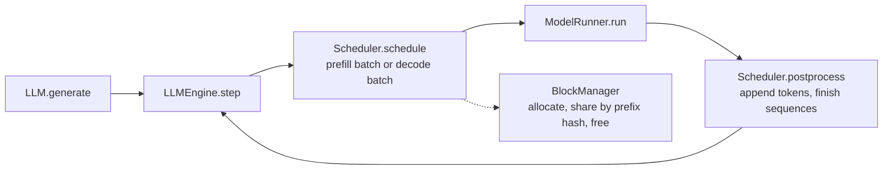

# nano-vllm

> Upstream: [GeeeekExplorer/nano-vllm](https://github.com/GeeeekExplorer/nano-vllm) · Commit I read: `<commit>` · Status: in progress

A small, readable engine that keeps the core ideas of vLLM: continuous batching, a paged KV cache with prefix caching, CUDA Graph for decode, and tensor parallelism.

## How I ran it

<!-- The exact commands, GPU, model and anything you had to fix. Someone should be able to copy this. -->

```bash
# GPU: <model>, driver <version>, CUDA <version>
git clone https://github.com/GeeeekExplorer/nano-vllm && cd nano-vllm
git checkout <commit>
pip install -e .
# model download and example command
```

## Architecture

<!-- Skeleton of the top-level loop. Check it against the commit you read, then extend it. -->



## Notes

| # | Question | Status |
|---|---|---|
| 01 | What happens to a request between `generate()` and the returned text? | planned |
| 02 | How does the scheduler choose prefill or decode, and when does it preempt? | planned |
| 03 | How are KV cache blocks allocated, shared by prefix hash, and freed? | planned |
| 04 | What does ModelRunner prepare for each step, and where is CUDA Graph used? | planned |
| 05 | How does tensor parallelism split the model and keep workers in sync? | planned |

## Issues I reproduced

Write-ups live in [issues/](issues/). The status of each one is tracked in [CONTRIBUTIONS.md](../../CONTRIBUTIONS.md).

## Resources

- [Understanding LLM Inference Engines: Inside Nano-vLLM](https://neutree.ai/blog/nano-vllm-part-1)
- [Inside vLLM: Anatomy of a High-Throughput LLM Inference System](https://www.aleksagordic.com/blog/vllm), for comparison with the real engine
