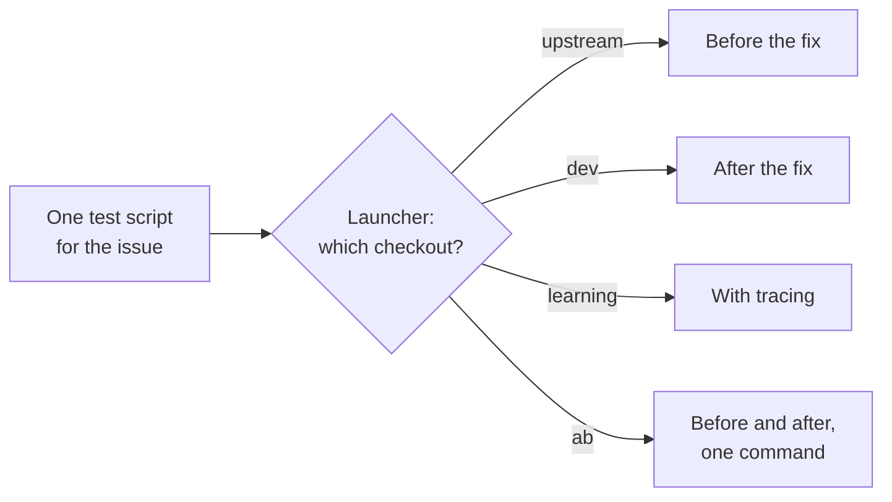
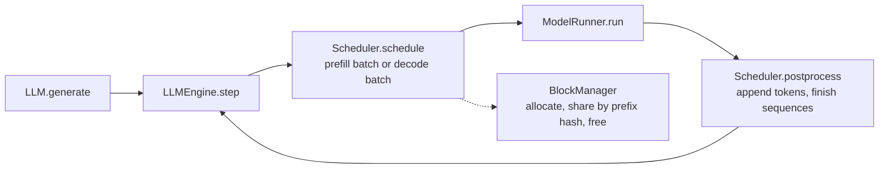

# nano-vllm

> Upstream: [GeeeekExplorer/nano-vllm](https://github.com/GeeeekExplorer/nano-vllm) · Commit I read: [`bb823b3`](https://github.com/GeeeekExplorer/nano-vllm/commit/bb823b3e06983d71485a8e1f23715ebd87d98ef8) · Status: in progress

A small, readable engine that keeps the core ideas of vLLM: continuous batching, a paged KV cache with prefix caching, CUDA Graph for decode, and tensor parallelism.

## How I ran it

Windows 11, NVIDIA GeForce RTX 4060 Laptop GPU (8 GB), driver 566.24. Conda environment `learn-vllm`: Python 3.10.21, torch 2.6.0+cu124 (CUDA 12.4), triton-windows 3.2.0, flash-attn 2.8.3, transformers 5.16.1.

```powershell
git clone https://github.com/GeeeekExplorer/nano-vllm; cd nano-vllm
git checkout bb823b3
pip install -e .
huggingface-cli download Qwen/Qwen3-0.6B --local-dir ~/huggingface/Qwen3-0.6B/
$env:USE_LIBUV = "0"
python example.py
```

Two things fail on Windows before the model even loads (upstream [#261](https://github.com/GeeeekExplorer/nano-vllm/issues/261)):

- PyTorch on Windows has no NCCL. In `ModelRunner.__init__`, I pass `"gloo"` instead of `"nccl"` to `dist.init_process_group` when `platform.system() == "Windows"`.
- The TCP store needs libuv, which PyTorch on Windows also lacks. Setting `USE_LIBUV=0` before running avoids it.

The first run spends about a minute in the warmup pass, mostly compiling `torch.compile` and Triton kernels.

## How I reproduce and test fixes

I keep three checkouts of one clone (git worktrees), each with a fixed role, and switch branches rather than making a new folder per issue:

| Checkout | Branch | Role |
|---|---|---|
| upstream | `upstream-main` | Unmodified upstream: how the original behaves |
| dev | `fix/<issue>-<name>`, one per issue | The fix I will send upstream, nothing else |
| learning | `learning` | My tracer, comments, and experiment-only options |

Tests and notes for each issue live in one local folder, outside all three checkouts. A small launcher runs any test script against a chosen checkout, in a fresh process. On Windows it swaps NCCL for gloo at runtime, so the upstream code stays untouched.



Two kinds of test script:

- **Scheduling and KV-block bugs:** drive `Scheduler` and `BlockManager` directly with fake tokens. No GPU, a few seconds per run. The [#274 write-up](issues/274-kv-cache-exhausted-assert.md) shows one.
- **Everything else:** the real engine. To shrink the KV cache on unmodified code, lower `gpu_memory_utilization`: 0.36 gives about 5 blocks on my 8 GB GPU.

Each new issue starts from a template: a checklist from reproduce to PR, one script of each kind, and folders for drafts and logs. The tools are local for now.

## Architecture

<!-- Skeleton of the top-level loop. Check it against the commit you read, then extend it. -->



## Notes

| # | Question | Status |
|---|---|---|
| 01 | What happens to a request between `generate()` and the returned text? | planned |
| 02 | How does the scheduler choose prefill or decode, and when does it preempt? | planned |
| 03 | How are KV cache blocks allocated, shared by prefix hash, and freed? | planned |
| 04 | What does ModelRunner prepare for each step, and where is CUDA Graph used? | planned |
| 05 | How does tensor parallelism split the model and keep workers in sync? | planned |

## Issues I reproduced

Write-ups live in [issues/](issues/). The status of each one is tracked in [CONTRIBUTIONS.md](../../CONTRIBUTIONS.md).

## Resources

- [Understanding LLM Inference Engines: Inside Nano-vLLM](https://neutree.ai/blog/nano-vllm-part-1)
- [Inside vLLM: Anatomy of a High-Throughput LLM Inference System](https://www.aleksagordic.com/blog/vllm), for comparison with the real engine
