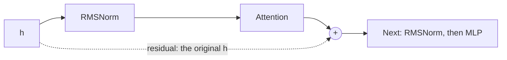

# [nano-vllm #170] RMSNorm overwrites its fp32 input and corrupts the residual

- Upstream issue: https://github.com/GeeeekExplorer/nano-vllm/issues/170 · Open PRs: [#169](https://github.com/GeeeekExplorer/nano-vllm/pull/169), [#171](https://github.com/GeeeekExplorer/nano-vllm/pull/171), [#205](https://github.com/GeeeekExplorer/nano-vllm/pull/205)
- Status: investigating (reproduced; root cause and the open PRs are next)
- Commit tested: `bb823b3`, unmodified upstream
- Written: 2026-10-02

<!-- Also add a row to CONTRIBUTIONS.md and keep its status in sync with this page. -->

## TL;DR

- **The bug:** when `RMSNorm` gets fp32 input, it writes its result over that input. In the model, the input is also the residual: the copy that is kept and added back after attention and after the MLP. So the residual connection adds back the wrong values.
- **Both ways nano-vllm calls `RMSNorm` are affected.** The issue names the first-layer path (`rms_forward`). The path every other norm uses (`add_rms_forward`) has the same problem.
- **bf16 is fine, and the model runs in bf16:** Qwen3-0.6B's `config.json` sets `torch_dtype` to `bfloat16`. nano-vllm cannot run the whole model in fp32 today anyway, because its attention uses FlashAttention, which rejects fp32. So the bug is real, but normal runs never hit it.
- **Three upstream PRs are already open** for it. Testing them is my next step.

## Background: the residual connection

Each decoder layer normalizes its input before attention, and again before the MLP. The value from before the norm, called the residual, is kept and added back afterwards:



The bug breaks the dotted path. In fp32, `RMSNorm` overwrites `h` with its own output, so what gets added back is the normalized value, not the original.

nano-vllm calls `RMSNorm` in two ways ([qwen3.py L152-L157](https://github.com/GeeeekExplorer/nano-vllm/blob/bb823b3e06983d71485a8e1f23715ebd87d98ef8/nanovllm/models/qwen3.py#L152-L157)):

| Where | Code | What it should do |
|---|---|---|
| First layer, before attention | `hidden_states, residual = self.input_layernorm(hidden_states), hidden_states` | Normalize `h`, and keep the original `h` as the residual |
| Every other norm | `hidden_states, residual = self.input_layernorm(hidden_states, residual)` | Add `h + residual` to get the new residual, then normalize that sum |

## How I reproduced it

The real engine cannot show this bug, because it never feeds fp32 into `RMSNorm`. So I called `RMSNorm` directly, copying the two calls from `qwen3.py`, once in fp32 and once in bf16.

The input is small enough to check by hand: `h = [1, 2, 3, 4]`, with all weights 1. RMSNorm divides each number by the square root of the mean of the squares: (1 + 4 + 9 + 16) / 4 = 7.5, √7.5 ≈ 2.74, so the output should be [0.37, 0.73, 1.10, 1.46].

## Results

| | First layer: the residual should stay `h` = [1, 2, 3, 4] | Every other norm (with residual = [1, 1, 1, 1]): the new residual should be `h + residual` = [2, 3, 4, 5] |
|---|---|---|
| **fp32** | ❌ [0.37, 0.73, 1.10, 1.46]: overwritten by the normalized value | ❌ [0.54, 0.82, 1.09, 1.36]: overwritten by the normalized value |
| **bf16** | ✅ [1, 2, 3, 4] | ✅ [2, 3, 4, 5] |

The normalized output was correct in all four cases. Only the residual is wrong.

## Next

- **Root cause:** why only fp32? The issue points at [`x = x.float()` in layernorm.py](https://github.com/GeeeekExplorer/nano-vllm/blob/bb823b3e06983d71485a8e1f23715ebd87d98ef8/nanovllm/layers/layernorm.py#L22). I want to confirm it myself.
- **The open PRs:** run the same two cases on #169, #171 and #205, then decide whether to comment on them or open my own.

## What I learned

-

---

## Appendix: technical details

<details>
<summary><b>Environment</b></summary>

```
date:     2026-10-02
os:       Windows 11 (MINGW64_NT-10.0-26200)
gpu:      NVIDIA GeForce RTX 4060 Laptop GPU, 8188 MiB, driver 566.24
python:   3.10.21
torch:    2.6.0+cu124 (CUDA 12.4)
triton-windows: 3.2.0.post21
flash-attn: 2.8.3
transformers: 5.16.1
nano-vllm: 0.2.0
repo:     nano-vllm @ bb823b3 (unmodified)
```

The repro imports `RMSNorm` without starting the engine, so it does not need the Windows workarounds for starting nano-vllm (upstream [#261](https://github.com/GeeeekExplorer/nano-vllm/issues/261)).

</details>

<details>
<summary><b>Repro script and output</b></summary>

Needs a CUDA GPU. Runs on an unmodified checkout.

```python
import torch
from nanovllm.layers.layernorm import RMSNorm


def show(t):
    return [round(v, 2) for v in t[0].float().tolist()]


with torch.inference_mode():
    for dtype in (torch.float32, torch.bfloat16):
        norm = RMSNorm(4).to("cuda", dtype)  # weight = 1, so it only normalizes

        # First layer (qwen3.py L153): the residual should stay the original h = [1, 2, 3, 4]
        h = torch.tensor([[1.0, 2.0, 3.0, 4.0]], device="cuda", dtype=dtype)
        out, residual = norm(h), h
        print(f"{dtype}  first layer:      output {show(out)}  residual {show(residual)}")

        # Every other norm (L155, L157): the new residual should be h + r = [2, 3, 4, 5]
        h = torch.tensor([[1.0, 2.0, 3.0, 4.0]], device="cuda", dtype=dtype)
        out, residual = norm(h, torch.ones_like(h))
        print(f"{dtype}  every other norm: output {show(out)}  residual {show(residual)}")
```

Output on `bb823b3`:

```
torch.float32  first layer:      output [0.37, 0.73, 1.1, 1.46]  residual [0.37, 0.73, 1.1, 1.46]
torch.float32  every other norm: output [0.54, 0.82, 1.09, 1.36]  residual [0.54, 0.82, 1.09, 1.36]
torch.bfloat16  first layer:      output [0.37, 0.73, 1.09, 1.46]  residual [1.0, 2.0, 3.0, 4.0]
torch.bfloat16  every other norm: output [0.54, 0.82, 1.09, 1.36]  residual [2.0, 3.0, 4.0, 5.0]
```

In fp32 the residual equals the output in both cases. In bf16 it is the expected value.

</details>

<details>
<summary><b>Why the whole model cannot run in fp32</b></summary>

nano-vllm's attention calls FlashAttention's `flash_attn_varlen_func` for prefill ([attention.py L67](https://github.com/GeeeekExplorer/nano-vllm/blob/bb823b3e06983d71485a8e1f23715ebd87d98ef8/nanovllm/layers/attention.py#L67)). Calling it with fp32 tensors fails on flash-attn 2.8.3:

```
RuntimeError: FlashAttention only support fp16 and bf16 data type
```

So changing `torch_dtype` to `float32` in `config.json` is not a way to hit this bug end to end. That is why the repro calls the layer directly.

</details>
