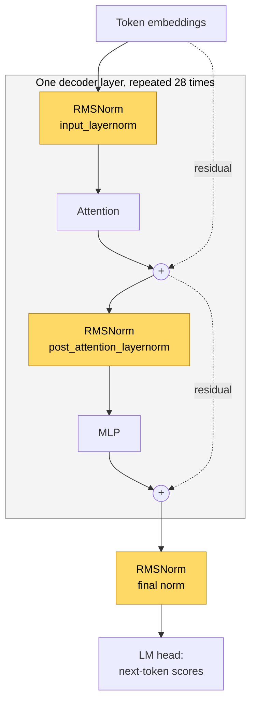

# [nano-vllm #170] RMSNorm overwrites its fp32 input and corrupts the residual

- Upstream issue: https://github.com/GeeeekExplorer/nano-vllm/issues/170 · Open PRs: [#169](https://github.com/GeeeekExplorer/nano-vllm/pull/169), [#171](https://github.com/GeeeekExplorer/nano-vllm/pull/171), [#205](https://github.com/GeeeekExplorer/nano-vllm/pull/205)
- Status: root cause found, fixes compared. Not opening a PR: #171 already fixes both code paths.
- Commit tested: `bb823b3`, unmodified upstream
- Written: 2026-10-02 · Updated: 2026-10-03

<!-- Also add a row to CONTRIBUTIONS.md and keep its status in sync with this page. -->

## TL;DR

- **The bug:** when `RMSNorm` gets fp32 input, it writes its result over that input. In the model, that input is also the residual, the copy that gets added back after attention and after the MLP. So the residual connection adds back the wrong values.
- **Both ways nano-vllm calls `RMSNorm` are affected.** The issue names the first-layer path (`rms_forward`). The path every other norm uses (`add_rms_forward`) has the same problem.
- **Why only fp32:** `x.float()` makes a new copy when `x` is bf16, but returns `x` itself when `x` is already fp32. The next line modifies `x` in place, so in fp32 it modifies the original.
- **Normal runs never hit it.** The model runs in bf16, and FlashAttention rejects fp32, so the whole model cannot run in fp32 anyway.
- **I compared my own fix with the three open PRs.** Only #171 fixes both paths: #169 fixes only `add_rms_forward`, and #205 only `rms_forward`. None of the fixes costs any speed. In bf16 every version compiles to one GPU kernel that moves the same number of bytes, and gives bit-identical output.

## Background

### What RMSNorm does

RMSNorm rescales each token's vector to a standard size, keeping the ratios between its numbers. Divide every number by the RMS (root mean square: square each number, take the mean, take the square root), then multiply each dimension by a learned weight:

```
[1, 2, 3, 4]      mean of squares = 7.5, RMS = 2.74   →  [0.37, 0.73, 1.10, 1.46]
[10, 20, 30, 40]  mean of squares = 750, RMS = 27.4   →  [0.37, 0.73, 1.10, 1.46]
```

Both give the same result: only the overall size is removed. Without it, the values in a 28-layer stack would drift larger or smaller from layer to layer. Compared with LayerNorm, RMSNorm skips subtracting the mean and has no bias, so it is cheaper. LLaMA and Qwen use it.

### Where the model uses it

Qwen3 is a pre-norm transformer. Inside each layer, RMSNorm runs before attention and again before the MLP. The value from before each norm, the residual, skips around the block and is added back afterwards:



The dotted lines are the residual path. RMSNorm normalizes only the copy that goes into attention or the MLP. The residual itself must pass through untouched. That is exactly what breaks in fp32.

nano-vllm does not add the residual right after each block. It carries the residual separately and does each `+` inside the next norm call, so the data is read from memory only once ([qwen3.py L152-L158](https://github.com/GeeeekExplorer/nano-vllm/blob/bb823b3e06983d71485a8e1f23715ebd87d98ef8/nanovllm/models/qwen3.py#L152-L158)). That gives two functions:

| Call | Function | Also adds | Calls per forward pass | Affected by #170? |
|---|---|---|---|---|
| Layer 0, `input_layernorm` | `rms_forward` | nothing yet | 1 | Yes: the residual is the input itself |
| Every layer, `post_attention_layernorm` | `add_rms_forward` | this layer's attention output | 28 | Yes: the returned residual is wrong |
| Layers 1 to 27, `input_layernorm` | `add_rms_forward` | the previous layer's MLP output | 27 | Yes |
| Final norm | `add_rms_forward` | the last MLP output | 1 | Yes |
| `q_norm`, `k_norm` inside attention | `rms_forward` | no residual | 56 | No: the input is overwritten, but nothing reads it afterwards |

So in fp32, every residual the model passes along would be wrong.

## The bug

### Reproduce

The real engine never feeds fp32 into `RMSNorm`, so I called the layer directly. I copied the two calls from `qwen3.py` and ran each once in fp32 and once in bf16, with input small enough to check by hand: `h = [1, 2, 3, 4]` and all weights 1.

| | First layer: the residual should stay `h` = [1, 2, 3, 4] | Every other norm (with residual = [1, 1, 1, 1]): the new residual should be `h + residual` = [2, 3, 4, 5] |
|---|---|---|
| **fp32** | ❌ [0.37, 0.73, 1.10, 1.46]: overwritten by the normalized value | ❌ [0.54, 0.82, 1.09, 1.36]: overwritten by the normalized value |
| **bf16** | ✅ [1, 2, 3, 4] | ✅ [2, 3, 4, 5] |

The normalized output was correct in all four cases. Only the residual is wrong.

### Root cause

Two lines in [`rms_forward`](https://github.com/GeeeekExplorer/nano-vllm/blob/bb823b3e06983d71485a8e1f23715ebd87d98ef8/nanovllm/layers/layernorm.py#L16-L26), each harmless on its own:

```python
x = x.float()                          # bf16: makes a new fp32 copy. fp32: returns x itself, no copy
x.mul_(torch.rsqrt(var + self.eps))    # in-place: writes into whatever x points to
```

`x.float()` is the same as `x.to(torch.float32)`, which returns the tensor itself when it already has that dtype. So in fp32, `x` is still the caller's tensor, and `mul_` overwrites it:

```
bf16, after x = x.float():
  h, residual ──► [1, 2, 3, 4]        the original, untouched
  x ───────────► [0.37 … 1.46]        the new copy; mul_ writes here

fp32, after x = x.float():
  h, residual, x ──► [0.37 … 1.46]    one tensor; mul_ writes into the original
```

`add_rms_forward` has the same pattern twice: `x.float().add_(...)` writes into the caller's tensor, and `residual = x.to(orig_dtype)` does not copy either, so `residual` and `x` are the same tensor and the next `mul_` overwrites both.

The code was written with bf16 in mind, where `.float()` always copies, so modifying in place saves memory. The rule it breaks: before modifying a tensor in place, check that no one else still holds it.

### Why normal runs never hit it

- Qwen3-0.6B runs in bf16: its `config.json` sets `torch_dtype` to `bfloat16`.
- The whole model cannot run in fp32 either: nano-vllm's attention uses FlashAttention, which raises `FlashAttention only support fp16 and bf16 data type` for fp32 input.

So the bug is real but latent. It would surface silently if the model ever ran in fp32, for example with a different attention backend.

## Fixes compared

### The candidates

| | Idea | `rms_forward` (first layer) | `add_rms_forward` (every other norm) |
|---|---|---|---|
| **My fix** | Check the dtype: when the input is already fp32, `clone()` it first | changed | changed |
| [PR #169](https://github.com/GeeeekExplorer/nano-vllm/pull/169) | Add `.clone()` to the returned residual | not changed | changed |
| [PR #171](https://github.com/GeeeekExplorer/nano-vllm/pull/171) | Always copy: `x.to(torch.float32, copy=True)` | changed | changed |
| [PR #205](https://github.com/GeeeekExplorer/nano-vllm/pull/205) | Don't modify in place: `x.mul_(...)` becomes `x = x * ...` | changed | not changed |

My fix changes three lines. In `rms_forward`:

```python
x = x.clone() if x.dtype == torch.float32 else x.float()
```

In `add_rms_forward`:

```python
x = (x.clone() if x.dtype == torch.float32 else x.float()).add_(residual.float())
residual = x.clone() if orig_dtype == torch.float32 else x.to(orig_dtype)
```

In bf16 it takes exactly the same path as the original.

### Correctness

I ran the same two cases on each PR's own branch, and on all versions side by side with random data at real size (4096 tokens × 1024 dimensions, random weights):

| | fp32, first layer | fp32, every other norm | bf16 output vs the original |
|---|---|---|---|
| Original | ❌ | ❌ | (reference) |
| **My fix** | ✅ | ✅ | bit-identical |
| PR #169 | ❌ | ✅ | bit-identical |
| PR #171 | ✅ | ✅ | bit-identical |
| PR #205 | ✅ | ❌ | bit-identical |

With #169 and #205, fp32 is still half broken. Every fix leaves bf16 output bit-identical, so the real model's output does not change.

### Speed

RMSNorm is a small, memory-bound operation: its speed is set by how many bytes it reads and writes. `torch.compile` records how many GPU kernels it generates and how many bytes they move, which is exact, unlike timing on a laptop GPU whose clock changes:

| 4096 tokens | bf16 `rms_forward` | bf16 `add_rms_forward` | fp32 `rms_forward` | fp32 `add_rms_forward` |
|---|---|---|---|---|
| Original | 1 kernel, 16 MB | 1 kernel, 32 MB | 1 kernel, 32 MB | 1 kernel, 48 MB |
| My fix | 1 kernel, 16 MB | 1 kernel, 32 MB | 1 kernel, 32 MB | 1 kernel, 64 MB |
| PR #169 | 1 kernel, 16 MB | 1 kernel, 32 MB | 1 kernel, 32 MB | 1 kernel, 64 MB |
| PR #171 | 1 kernel, 16 MB | 1 kernel, 32 MB | 1 kernel, 32 MB | 1 kernel, 64 MB |
| PR #205 | 1 kernel, 16 MB | 1 kernel, 32 MB | 1 kernel, 32 MB | 1 kernel, 48 MB |

Measured time in bf16, 16384 tokens (about the largest prefill), GPU time per call:

| | `rms_forward` | `add_rms_forward` |
|---|---|---|
| Original | 297.0 µs | 581.5 µs |
| My fix | 296.9 µs | 581.2 µs |
| PR #169 | 296.7 µs | 580.8 µs |
| PR #171 | 297.0 µs | 581.2 µs |
| PR #205 | 296.7 µs | 581.0 µs |

The differences are below 0.1%. Why there is no cost:

- `torch.compile` fuses the whole function into one kernel that reads the input once and writes the output once. Writing in place versus into a new tensor only changes where the result goes, not how much data moves. So the memory the original saved with `mul_` is not actually saved once compiled.
- The only change is fp32 `add_rms_forward`, from 48 MB to 64 MB. That is the bug itself: the original wrote the output and the new residual into the same tensor, so it wrote one 16 MB tensor instead of two. Writing both is the cost of being correct, and it only happens in fp32.

### Verdict

All the complete fixes perform the same, so the choice is about readability. My dtype check works, but every place that might not copy needs its own branch, and a new in-place line added later could slip through. #171 needs no branches, and so does applying #205's idea to both functions, which is how HuggingFace's `Qwen3RMSNorm` is written. #171 already fixes both paths, so a fourth PR would add nothing.

## What I learned

- Why RMSNorm? -> To scale every token embedding to the same scale, without shifting to zero-mean.
- Why not LayerNorm? -> Faster, no need to do average and bias.  
- When use RMSNrom? -> before the attention and MLP in every block, and also before the last layer.
- RMSNorm and residual? -> Only norm on the original input, residual is circumvented. 
- Core isuse? -> x.float() will copy the data when x is not float32. 
- My implementation? -> Add a if-else judgement, it can fix the bug, and find another situation that other PRs has not considered widely. My methods also fixed the second issue. 
- Compute and speed? Almost the same time and memory across the 4 implementations. 
- Decision? -> Decide not to raise my PR, since #170 has already resolved these two issues. 

---

## Appendix: technical details

<details>
<summary><b>Environment</b></summary>

```
date:     2026-10-02
os:       Windows 11 (MINGW64_NT-10.0-26200)
gpu:      NVIDIA GeForce RTX 4060 Laptop GPU, 8188 MiB, driver 566.24
python:   3.10.21
torch:    2.6.0+cu124 (CUDA 12.4)
triton-windows: 3.2.0.post21
flash-attn: 2.8.3
transformers: 5.16.1
nano-vllm: 0.2.0
repo:     nano-vllm @ bb823b3 (unmodified)
```

The scripts import `RMSNorm` without starting the engine, so they do not need the Windows workarounds for starting nano-vllm (upstream [#261](https://github.com/GeeeekExplorer/nano-vllm/issues/261)).

</details>

<details>
<summary><b>Repro script and output</b></summary>

Needs a CUDA GPU. Runs on an unmodified checkout.

```python
import torch
from nanovllm.layers.layernorm import RMSNorm


def show(t):
    return [round(v, 2) for v in t[0].float().tolist()]


with torch.inference_mode():
    for dtype in (torch.float32, torch.bfloat16):
        norm = RMSNorm(4).to("cuda", dtype)  # weight = 1, so it only normalizes

        # First layer (qwen3.py L153): the residual should stay the original h = [1, 2, 3, 4]
        h = torch.tensor([[1.0, 2.0, 3.0, 4.0]], device="cuda", dtype=dtype)
        out, residual = norm(h), h
        print(f"{dtype}  first layer:      output {show(out)}  residual {show(residual)}")

        # Every other norm (L155, L157): the new residual should be h + r = [2, 3, 4, 5]
        h = torch.tensor([[1.0, 2.0, 3.0, 4.0]], device="cuda", dtype=dtype)
        out, residual = norm(h, torch.ones_like(h))
        print(f"{dtype}  every other norm: output {show(out)}  residual {show(residual)}")
```

Output on `bb823b3`:

```
torch.float32  first layer:      output [0.37, 0.73, 1.1, 1.46]  residual [0.37, 0.73, 1.1, 1.46]
torch.float32  every other norm: output [0.54, 0.82, 1.09, 1.36]  residual [0.54, 0.82, 1.09, 1.36]
torch.bfloat16  first layer:      output [0.37, 0.73, 1.09, 1.46]  residual [1.0, 2.0, 3.0, 4.0]
torch.bfloat16  every other norm: output [0.54, 0.82, 1.09, 1.36]  residual [2.0, 3.0, 4.0, 5.0]
```

</details>

<details>
<summary><b>How I tested the PRs</b></summary>

Each PR only changes `layernorm.py` (#205 also adds a test), and all three branch from `2f21442`, where `layernorm.py` is identical to `bb823b3`. So their versions can be compared directly.

1. I fetched each PR branch into a temporary worktree (`git fetch origin pull/<N>/head:pr-<N>`, then `git worktree add`) and ran the repro against it. Results: #169 fails the first-layer case, #171 passes both, #205 fails the every-other-norm case.
2. For the side-by-side numbers, I copied each PR's two functions verbatim into subclasses of `RMSNorm`, kept `@torch.compile`, and ran them next to the original and my fix. The same script also checked two more variants: #171's idea with only the three necessary lines changed, and #205's idea applied to both functions. Both fix both paths, with the same kernel count, bytes and time.

One more detail: with the original, #169 and #205, fp32 `add_rms_forward` also overwrites its input `x`. In the model that input is the attention or MLP output, which is not used again, so this does no harm. I check only what the model receives.

</details>

<details>
<summary><b>Measuring speed on a laptop GPU</b></summary>

- My first timings at 64 and 4096 tokens jumped between runs. One run showed the original 7× slower than the fixes. Changing the order changed the winner. The cause was the laptop GPU's clock speed changing, plus whichever version ran first paying the warm-up.
- `torch.profiler` on Windows reported zero CUDA kernels, so I could not count kernels that way.
- What worked: `torch._inductor.metrics.generated_kernel_count` and `num_bytes_accessed`, read after forcing a fresh compile. They are exact, and for a memory-bound op they predict the speed.
- For measured time, I captured 100 calls in a CUDA graph (decode runs this way in nano-vllm), replayed it 15 times and took the median, alternating the order of the versions over 4 rounds. At 16384 tokens the results are stable. Even so, across runs one random version was sometimes 5 to 15% slower in a single run.

</details>

<details>
<summary><b>Side note: in-place is fine here, not in training</b></summary>

nano-vllm only runs inference, under `@torch.inference_mode()` ([model_runner.py L195](https://github.com/GeeeekExplorer/nano-vllm/blob/bb823b3e06983d71485a8e1f23715ebd87d98ef8/nanovllm/engine/model_runner.py#L195)), so autograd records nothing and in-place ops are safe as long as no one else holds the tensor. In training the original code would fail even in bf16: `x.pow(2)` saves `x` for the backward pass, `x.mul_` then modifies it, and `backward()` raises `one of the variables needed for gradient computation has been modified by an inplace operation`. HuggingFace's `Qwen3RMSNorm`, which supports training, writes the same steps without in-place ops.

</details>

<details>
<summary><b>Why the whole model cannot run in fp32</b></summary>

nano-vllm's attention calls FlashAttention's `flash_attn_varlen_func` for prefill ([attention.py L67](https://github.com/GeeeekExplorer/nano-vllm/blob/bb823b3e06983d71485a8e1f23715ebd87d98ef8/nanovllm/layers/attention.py#L67)). Calling it with fp32 tensors fails on flash-attn 2.8.3:

```
RuntimeError: FlashAttention only support fp16 and bf16 data type
```

So changing `torch_dtype` to `float32` in `config.json` is not a way to hit this bug end to end. That is why the repro calls the layer directly.

</details>
