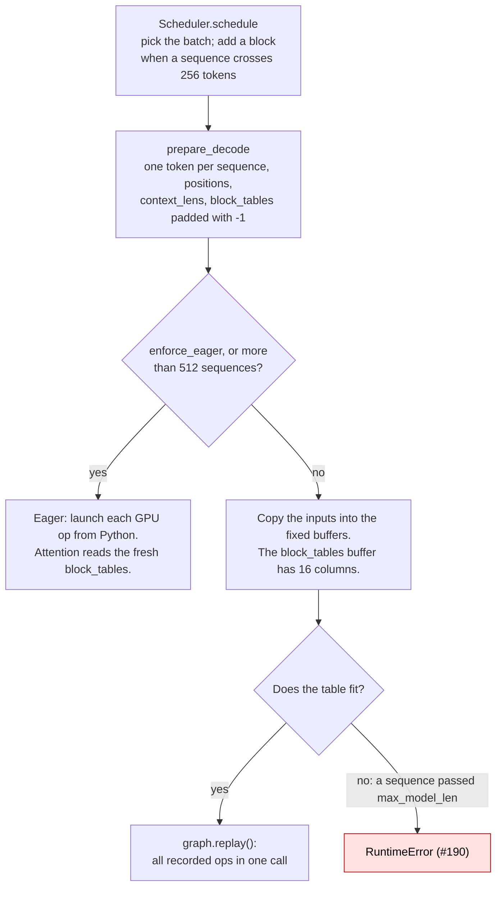

# [nano-vllm #190] CUDA graph replay fails once a sequence grows past max_model_len

- Upstream issue: https://github.com/GeeeekExplorer/nano-vllm/issues/190 · Same bug, reported earlier: [#106](https://github.com/GeeeekExplorer/nano-vllm/issues/106) · Open PRs that mention it: [#191](https://github.com/GeeeekExplorer/nano-vllm/pull/191), [#258](https://github.com/GeeeekExplorer/nano-vllm/pull/258), [#263](https://github.com/GeeeekExplorer/nano-vllm/pull/263)
- Status: investigating. I understand the bug from the code and have looked inside the recorded graphs; reproducing it is next.
- Commit read: `bb823b3`, unmodified upstream
- Written: 2026-10-03 · Updated: 2026-10-05

<!-- Also add a row to CONTRIBUTIONS.md and keep its status in sync with this page. -->

## TL;DR

- **The bug:** with CUDA graph on (`enforce_eager=False`), decode crashes with `RuntimeError: The expanded size of the tensor (16) must match the existing size (17)` as soon as any sequence in the batch grows past `max_model_len` (4096 by default).
- **Why:** CUDA graph replays GPU work recorded at startup, and that work reads fixed buffers. The `block_tables` buffer has `max_model_len / 256` = 16 columns, so it fits sequences of up to 4096 tokens. Nothing stops a sequence from growing longer: neither the scheduler nor `SamplingParams` checks `max_model_len`. A 4097-token sequence needs a 17th column, and the copy into the buffer fails.
- **Only the CUDA graph path is affected.** Prefill, `enforce_eager=True`, and batches of more than 512 sequences build their tensors fresh every step. `example.py` sets `enforce_eager=True`, so it never hits this.
- **Next:** reproduce it on my GPU, then weigh the fix directions and the open PRs.

## What I learned

- What cuda_graph looks like? -> print the results and checked
- Difference on batch size -> the kernel changes wr.t. batch size. for batch = 1 or 16, the mat_mul change from gemv to cutlass, attention changed from 4 pieces to more pieces, 
- How long sequence is split -> flash_fwd_splitkv + combine
- 

## Background: how one decode step runs

To follow this bug I first had to understand how a decode step turns a batch of sequences into GPU work. The example below is used throughout: three running sequences, A with 600 tokens, B with 300, and C with 100.

### A batch is computed together

In a decode step, every sequence in the batch adds one token, and all of them go through the model in the same forward pass. Each GPU operation is launched once for the whole batch.

Most layers see a plain matrix: one row per sequence, so `[3, 1024]` here, with no padding. Each row is computed independently. Positions differ per row (599, 299, 99), and the rotary embedding uses each row's own position. Each new token's K and V are written to its own slot in the KV cache.

Attention is the only layer that looks at history, and the histories differ in length and live in different KV blocks of 256 tokens. One call to FlashAttention handles all three sequences, so it gets two extra inputs:

```
KV blocks per sequence (256 tokens each):
A: 600 tokens → 3 blocks [5, 9, 12]
B: 300 tokens → 2 blocks [7, 3]
C: 100 tokens → 1 block  [4]

block_tables =             context_lens =
[[5,  9, 12],    ← A       [600,
 [7,  3, -1],    ← B        300,
 [4, -1, -1]]    ← C        100]
```

- **Why pad?** A GPU tensor must be a rectangle, so shorter rows are padded to the longest row.
- **Does padding cost compute?** No. For each sequence, attention reads only `ceil(context_len / 256)` entries of its row, so the `-1` entries are never read. `-1` is just a value that can never be a valid block ID.
- **Does it cost memory?** Almost none: 4 bytes per entry. Even the whole CUDA graph buffer (512 × 16) is 32 KB, while one KV block is about 28 MB (2 × 28 layers × 256 tokens × 8 KV heads × 128 dims × 2 bytes).

### What CUDA graph does

CUDA graph changes how the work is launched, not what is computed.

- **Eager:** Python launches each GPU operation one by one. A decode step is 395 operations at batch size 1, as I counted from a recorded graph ([below](#inside-a-recorded-graph)): 14 per layer times 28 layers, plus a few more. Each launch costs the CPU a few microseconds, while each operation does very little work (one token per sequence). So the GPU spends much of its time waiting for the next launch.
- **CUDA graph:** at startup, nano-vllm records the whole list of operations, including the memory addresses they read and write. Each decode step then runs the whole list with one `graph.replay()` call.
- **The price:** the recording fixes every address and shape. Each step must copy its inputs into the same buffers that were used during recording, and those buffers cannot change size.

Details that follow from this:

- **One graph per batch size.** Shapes are part of the recording, so nano-vllm records 36 graphs, for batch sizes 1, 2, 4, 8, 16, 32 and so on up to 512. A batch is padded up to the next recorded size: 3 sequences use the graph for 4, and 17 use the graph for 32. Empty seats get `context_lens = 0`, so attention skips them, but they still go through every matrix multiply.
- **Largest first, one memory pool.** The graphs are recorded from largest to smallest and share one memory pool, so the smaller ones reuse the memory the largest one claimed.
- **Decode only.** A decode step is small and repeats thousands of times, so launch overhead dominates. A prefill step works on hundreds or thousands of tokens, so the GPU work dominates, and its size changes every time.
- **`compute_logits` runs outside the graph.** It runs eagerly after the replay.

### One decode step in code



| Step | Code |
|---|---|
| Each sequence keeps its own list of block IDs | [`Sequence.block_table`](https://github.com/GeeeekExplorer/nano-vllm/blob/bb823b3e06983d71485a8e1f23715ebd87d98ef8/nanovllm/engine/sequence.py#L28) |
| The scheduler adds a block when a sequence crosses a 256-token boundary, with no length limit | [`may_append`](https://github.com/GeeeekExplorer/nano-vllm/blob/bb823b3e06983d71485a8e1f23715ebd87d98ef8/nanovllm/engine/block_manager.py#L106-L108), called from [`schedule`](https://github.com/GeeeekExplorer/nano-vllm/blob/bb823b3e06983d71485a8e1f23715ebd87d98ef8/nanovllm/engine/scheduler.py#L57-L73) |
| The batch's inputs are built on the CPU, with `block_tables` padded to the longest row | [`prepare_decode`](https://github.com/GeeeekExplorer/nano-vllm/blob/bb823b3e06983d71485a8e1f23715ebd87d98ef8/nanovllm/engine/model_runner.py#L172-L188), [`prepare_block_tables`](https://github.com/GeeeekExplorer/nano-vllm/blob/bb823b3e06983d71485a8e1f23715ebd87d98ef8/nanovllm/engine/model_runner.py#L123-L127) |
| They go on a global "context" that attention reads, because the model's entry point only takes `input_ids` and `positions` | [`set_context`](https://github.com/GeeeekExplorer/nano-vllm/blob/bb823b3e06983d71485a8e1f23715ebd87d98ef8/nanovllm/utils/context.py) |
| Eager, or copy into the buffers and replay | [`run_model`](https://github.com/GeeeekExplorer/nano-vllm/blob/bb823b3e06983d71485a8e1f23715ebd87d98ef8/nanovllm/engine/model_runner.py#L196-L212) |
| At startup: the buffers are created and one graph is recorded per batch size, with the context pointing at the buffers | [`capture_cudagraph`](https://github.com/GeeeekExplorer/nano-vllm/blob/bb823b3e06983d71485a8e1f23715ebd87d98ef8/nanovllm/engine/model_runner.py#L223-L257) |
| Attention reads `block_tables` and `context_lens` from the context | [`attention.py` L71-L74](https://github.com/GeeeekExplorer/nano-vllm/blob/bb823b3e06983d71485a8e1f23715ebd87d98ef8/nanovllm/layers/attention.py#L71-L74) |

The key link is in `capture_cudagraph`: during recording, the context points at the buffers. So the recorded attention reads the buffer's memory, and each replay reads the same memory.

## The bug

The buffer's width is set once, at startup ([model_runner.py L227, L232](https://github.com/GeeeekExplorer/nano-vllm/blob/bb823b3e06983d71485a8e1f23715ebd87d98ef8/nanovllm/engine/model_runner.py#L227-L232)):

```python
max_num_blocks = (config.max_model_len + self.block_size - 1) // self.block_size   # 4096 / 256 = 16
block_tables = torch.zeros(max_bs, max_num_blocks, dtype=torch.int32)               # 512 rows × 16 columns
```

Before each replay, the step's table is copied into the top-left corner of that buffer ([L210](https://github.com/GeeeekExplorer/nano-vllm/blob/bb823b3e06983d71485a8e1f23715ebd87d98ef8/nanovllm/engine/model_runner.py#L210)):

```python
graph_vars["block_tables"][:bs, :context.block_tables.size(1)] = context.block_tables
```

Follow one sequence as it grows:

| Sequence length | Blocks needed | Columns in this step's table | Fits in 16 columns? |
|---|---|---|---|
| 4095 | 16 | 16 | ✅ |
| 4096 | 16 | 16 | ✅ |
| 4097 | 17 | 17 | ❌ `RuntimeError` |

That matches the error in #190: `Target sizes: [32, 16]. Tensor sizes: [32, 17]`, meaning 32 sequences, a buffer 16 entries wide, and a table 17 entries wide. #106 shows `64` versus `65`, so that user had set `max_model_len` to 16384. A comment there names the cause: `max_tokens` was 20000 while `max_model_len` was the default 4096.

`max_model_len` is used in only two places: to size the warmup batch and to size this buffer. It is not a limit. Apart from this buffer, the model could handle longer sequences: the rotary embedding covers 40960 positions, and an 8 GB GPU holds over 40K tokens of KV cache.

**Why not use a wider tensor at runtime?** The recorded attention kernel holds the buffer's address and its row width. A new tensor would live at another address that the recording does not know about. Using a wider table means recording the graphs again, which takes seconds.

## Inside a recorded graph

To see what a graph actually holds, I turned on CUDA graph debug mode before nano-vllm recorded its graphs (`enable_debug_mode()`, by swapping in a `CUDAGraph` subclass, with nano-vllm's code unchanged), then wrote each graph out with `debug_dump()`. The dump lists every recorded node: the kernel and its launch configuration `<<<grid, threads per block, shared memory>>>`. Settings: `max_num_seqs=16`, so 5 graphs were recorded, for batch sizes 1, 2, 4, 8 and 16.

**The graph for batch size 1 has 395 nodes: 394 kernels and 1 memory copy.** After the embedding lookup, every layer is the same 14 kernels:

| # in layer | Kernel | What it does |
|---|---|---|
| 1 | `triton_per_fused_..._rsqrt` | `input_layernorm`: RMSNorm, fused into one kernel by `torch.compile` |
| 2 | `gemvx` | qkv projection (a matrix-vector product, since there is one token) |
| 3, 4 | `triton_per_fused_..._rsqrt` | `q_norm` (grid 16: one per query head) and `k_norm` (grid 8: one per KV head) |
| 5, 6 | `triton_poi_fused_..._cat` | rotary embedding on q, then on k |
| 7 | `store_kvcache_kernel` | write the new token's K and V into the KV cache |
| 8, 9 | `flash_fwd_splitkv_kernel`, `flash_fwd_splitkv_combine_kernel` | attention, split into 4 chunks, then the chunks combined |
| 10 | `gemvx` | output projection |
| 11 | `triton_per_fused_..._rsqrt` | `post_attention_layernorm`, with the residual add |
| 12 | `cutlass::Kernel2` | gate and up projections |
| 13 | `triton_poi_fused_mul_silu` | SiLU and multiply |
| 14 | `gemvx` | down projection |

The counts add up: 28 layers × 14 = 392, plus the embedding and the final norm makes 394 kernels. The extra node copies the result into the `outputs` buffer. The RMSNorm kernel appears 113 times (28 × 4 + 1), and `gemvx` 84 times (28 × 3).

**Batch size 16 is not the same graph with bigger launches.** Its graph has 367 nodes, and the kernels themselves change:

| | Batch size 1 | Batch size 16 |
|---|---|---|
| Matrix multiplies | `gemvx` (matrix × vector) for qkv, output and down | `cutlass::Kernel2` (matrix × matrix) for all four |
| Attention | grid `{1, 4, 8}`: 4 splits × 8 KV heads, then a combine kernel | grid `{1, 16, 8}`: 16 sequences × 8 KV heads, no split, no combine kernel |
| `q_norm`, `k_norm` | `triton_per_...` | `triton_red_...`, a different reduction strategy |
| Elementwise kernels | grids of 1, 8, 12 blocks | grids of 16, 128, 192 blocks |

The missing combine kernel accounts for the difference: 395 − 28 = 367. So a graph really is tied to one batch size: the kernel choice, not only the launch sizes, depends on it.

The attention split is the split-KV idea from [below](#questions-for-later-decode-performance), done automatically by FlashAttention: at batch size 1 there are only 8 blocks of work (one per KV head), too few to fill the GPU, so each is split in 4. At batch size 16 there is enough work without splitting. The split count is part of the recorded launch, so it is fixed when the graph is recorded.

### Two claims in the issue to check

- "The buffer is not cleared before copying." Columns beyond this step's width keep values from earlier steps. Does attention ever read them, given that it stops at `context_lens`?
- "Allocate one extra column." Does that fix the bug, or only move the crash from 4097 tokens to 4353?

## Fix directions to weigh

1. Make the buffer wider from the start. How wide is enough?
2. When the table does not fit, run that step eagerly. PR #191 does this, and also clears the buffer.
3. Enforce `max_model_len`: stop or reject sequences at the limit, so the table never outgrows the buffer.

PRs #258 ("guard CUDA graph block table replay") and #263 ("validate request token limits") also mention this issue. I have not read them yet.

## Next

- Reproduce it: shrink `max_model_len` to 512, so the buffer has 2 columns. Then let a 500-token prompt generate past 512 tokens with `ignore_eos`, with CUDA graph on and off.
- Compare the fix directions and the three PRs.

## Questions for later: decode performance

These came up while reading this code. They are beyond #190:

- **Inputs are rebuilt on the CPU every step.** `prepare_decode` loops over every sequence in Python each step, even though most values change only slightly. Some rebuilding is unavoidable, because the batch changes every step as sequences finish, join or get preempted (continuous batching). This is upstream [#175](https://github.com/GeeeekExplorer/nano-vllm/issues/175), with PRs [#176](https://github.com/GeeeekExplorer/nano-vllm/pull/176) and [#253](https://github.com/GeeeekExplorer/nano-vllm/pull/253). Two ideas to read about: keeping input buffers alive and updating only what changed, and SGLang's overlap scheduling, which prepares the next batch on the CPU while the GPU runs the current one.
- **One very long sequence among short ones.** Padding is not the problem; load imbalance is. The long sequence's attention keeps working after the short ones finish. Split-KV ("Flash-Decoding") cuts a long history into chunks computed in parallel. FlashAttention's `flash_attn_with_kvcache` has a `num_splits` argument, default 0, which picks the split count automatically. The recorded graphs show it at work: attention is split in 4 at batch size 1 and not split at batch size 16.
- **Batch padding to recorded sizes.** 17 sequences run as 32. More recorded sizes would waste fewer rows, but cost more startup time and memory.
