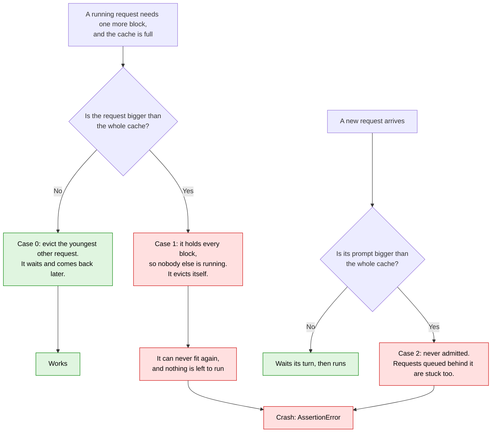
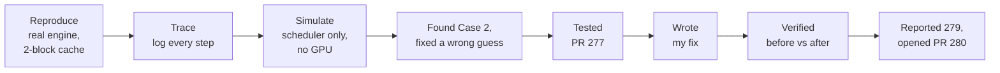
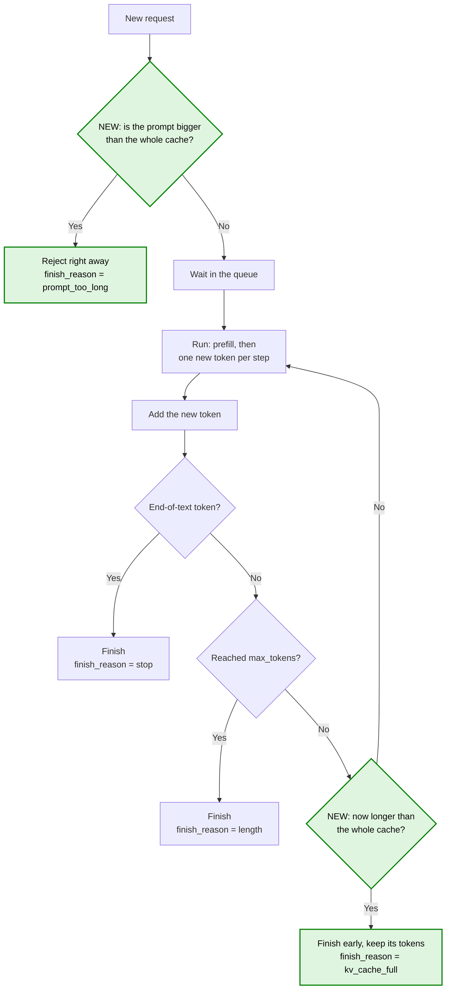

# [nano-vllm #274] Engine crashes on assert scheduled_seqs when one sequence outgrows the KV cache

- Upstream issue: https://github.com/GeeeekExplorer/nano-vllm/issues/274 · Case 2 reported by me as [#279](https://github.com/GeeeekExplorer/nano-vllm/issues/279)
- Status: PR open, [#280](https://github.com/GeeeekExplorer/nano-vllm/pull/280) (fixes #274 and #279)
- Commit tested: `bb823b3` plus my local learning patches (tracing and a KV block cap); the PR itself was tested on a clean `bb823b3`
- Written: 2026-09-25 · Updated: 2026-09-29

## TL;DR

- **The bug:** if one request needs more memory than the entire KV cache, nano-vllm crashes with a bare `AssertionError`.
- **Why:** the scheduler has no plan for a request that can never fit. It keeps the request around, finds nothing it can run, and trips an `assert`.
- **Two ways to hit it:** a request grows too big while it generates (Case 1, the reported bug), or its prompt is too big from the start (Case 2, which I reported as [#279](https://github.com/GeeeekExplorer/nano-vllm/issues/279)).
- **My fix:** turn Case 2 away at the door, and end Case 1 early with the tokens it already has. Every other request finishes normally. Submitted upstream as [PR #280](https://github.com/GeeeekExplorer/nano-vllm/pull/280).
- **Upstream PR 277** turns the crash into a clearer error, but the whole batch still stops.

## What I learned

- **Preemption only helps if someone else can make room.** When the request itself is the problem, evicting it just delays the crash.
- **Whether an evicted request can come back depends on the cache's total size, not on current free space.** Free space returns as others finish; the total never grows.
- **One stuck request at the head of the queue blocks everyone behind it.** The prefill loop never looks past it.
- **Where a check lives matters as much as what it checks.** The same condition in the scheduler loop would have lost the request's output.
- **"Don't crash" is not the whole goal.** Ask who pays for the failure: with PR 277 the whole batch pays; with the fix, only the request that cannot fit.
- **Simulate first and predict the numbers.** A scheduler-only script ran in seconds, caught a wrong guess of mine, and turned each run into a real test.

## The failing cases

### Background: the KV cache is a fixed set of blocks

Every token a request has seen needs a slot in the KV cache. Slots come in blocks of 256 tokens. The number of blocks is fixed at startup and shared by all requests. My repro shrinks the cache to 2 blocks:

```
KV cache: 2 blocks = 512 tokens
┌──────── block 0 ────────┐┌──────── block 1 ────────┐
│ tokens 1 … 256          ││ tokens 257 … 512        │
└─────────────────────────┘└─────────────────────────┘
token 513  →  needs a 3rd block  →  the cache has no 3rd block
```

When the cache is full and a request needs one more block, the scheduler **preempts** the youngest running request: it frees that request's blocks and sends it back to the queue to be recomputed later. That works as long as the request can fit again someday.

### Three cases



| Case | What happens | Example | Before the fix |
|---|---|---|---|
| **0. Normal preemption** | The cache is full, but another request can make room. | In my tracing demo, request 1 needed a block, so request 4 was evicted and came back later. | Works |
| **1. Grows too big** | The prompt fits, but the request outgrows the whole cache while generating. This is the reported bug. | 2-block cache, 500-token prompt. At token 513 it needs a third block. | Crash at step 14 |
| **2. Too big from the start** | The prompt alone is bigger than the cache. It is never admitted, and it blocks every request queued behind it. | 2-block cache, 600-token prompt. | Crash at step 1. If others are running, they finish first, requests behind it never run, then it crashes. |

Both failing cases end on the same line in `schedule()`: `assert scheduled_seqs`, which assumes every step has at least one request to run.

## What I did



1. **Reproduce.** Shrank the KV cache to 2 blocks and ran a 500-token prompt. It crashed at step 14, right when it needed token 513.
2. **Trace.** Logged every scheduler step. The last step shows the request evicting itself, then the crash.
3. **Simulate.** The real engine takes a minute or two per run, mostly warmup. So I wrote a small script that drives only the scheduler, with fake tokens and no GPU. Each run takes seconds.
4. **Found Case 2, and corrected myself.** The simulation showed a second way to crash: a prompt that never fits. I had also guessed that a request could outgrow the cache while another request was still running. That is impossible: to outgrow a 4-block cache, a request must already hold all 4 blocks, so nothing else can be running.
5. **Tested PR 277** on the same scenarios. It replaces the crash with an error, but still stops everything.
6. **Wrote my fix.**
7. **Verified** every scenario before and after the fix, on the simulation and on the real engine.
8. **Went upstream.** Reported Case 2 as its own issue, [#279](https://github.com/GeeeekExplorer/nano-vllm/issues/279), since #274 only covers Case 1. Rebuilt the fix on a clean copy of upstream, tested it again there, and opened [PR #280](https://github.com/GeeeekExplorer/nano-vllm/pull/280) for both issues.

## The fix

**Principle:** only the request that cannot fit is affected. Everyone else finishes normally, and nothing raises.

Submitted upstream as [PR #280](https://github.com/GeeeekExplorer/nano-vllm/pull/280): one commit on a clean `bb823b3`, 3 files, +24 / −7, with none of my learning patches.

The diagram shows a request's life. The two green checks are new:



### What changed where

| Where | Change | In plain words |
|---|---|---|
| `scheduler.py`, `add()` | Size check when a request arrives | A prompt that can never fit is turned away at the door (Case 2). |
| `scheduler.py`, `postprocess()` | Size check after each new token | A request that just outgrew the cache ends here, keeping what it generated (Case 1). |
| `sequence.py` | New `finish_reason` field | Each request records why it ended. |
| `llm_engine.py` | Returns `finish_reason`; handles rejected requests | The caller sees why each request ended, including rejected ones. |
| `schedule()` and its `assert` | **Unchanged** | With the two checks in place, neither case reaches it any more. |

**Why the second check lives in `postprocess()`.** My first plan was to catch Case 1 in the scheduler's decode loop, where the request evicts itself. That would still leave the step with nothing to run, and the request's output would get lost. `postprocess()` is where finished requests are already handled after each step. Ending the request there, one step earlier, avoids both problems.

### PR 277 vs my fix (PR 280)

| | Upstream PR 277 | My fix, PR 280 |
|---|---|---|
| Approach | Turns the crash into a clearer error | Prevents the crash |
| Case 1 | Error; everything stops | The request ends early and keeps its tokens |
| Case 2 | Error, but only after it has blocked the queue | Rejected on arrival |
| Other requests in the same batch | Their results are lost | Finish normally |
| Engine afterwards | Raises the same error again on every step | Keeps working |
| Size | 1 line | 3 files, +24 / −7 |

The PR's error message also suggests two settings that would not help. Details are in the appendix.

## Results

| Scenario | Before | After |
|---|---|---|
| Case 1, real engine (500-token prompt, 2 blocks) | Crash at step 14 | Ends at step 13 with 13 tokens (`kv_cache_full`) |
| Case 2, real engine (50000-token prompt) | Crash at step 1 (expected from the simulation, not run) | Rejected at once (`prompt_too_long`) |
| Case 2 with others: A, then oversized P, then C | C never runs; crash at step 21 | P rejected; A and C both finish |
| Case 1 with a request D queued behind | D never runs; crash at step 26 | Ends early with 25 tokens; then D finishes |
| Case 0, normal preemption (`trace_example.py`) | 1 preemption; all 4 finish | Unchanged |
| `example.py` | Normal output | Same text, plus `finish_reason` |

All step numbers matched what I predicted before running.

For PR #280, I re-ran the checks on a clean `bb823b3`, without my local patches. Upstream has no option to cap the number of KV blocks, so I shrank the cache with `gpu_memory_utilization=0.36` instead, which gave 5 blocks (1280 tokens) on my GPU. Before the fix, a batch with an oversized request crashed and returned nothing. After the fix, the oversized request ended early or was rejected, and the others finished. The numbers are in the PR description.

---

## Appendix: technical details

<details>
<summary><b>Environment</b></summary>

```
date:     2026-09-25
os:       Windows 11 (MINGW64_NT-10.0-26200)
gpu:      NVIDIA GeForce RTX 4060 Laptop GPU, 8188 MiB, driver 566.24
python:   3.10.21
torch:    2.6.0+cu124 (CUDA 12.4)
triton:   3.2.0 (triton-windows, added by hand: collect_env.sh looks for the package name "triton")
flash-attn: 2.8.3
transformers: 5.16.1
nano-vllm: 0.2.0
repo:     nano-vllm @ bb823b3 (uncommitted changes)
model:    Qwen3-0.6B
```

On Windows, nano-vllm also needs the `gloo` backend instead of NCCL, and `USE_LIBUV=0`, to start (upstream [#261](https://github.com/GeeeekExplorer/nano-vllm/issues/261)).

With a normal KV cache this bug is hard to hit: on an 8 GB GPU the cache holds about 163 blocks, or about 42K tokens, far more than the default `max_model_len` of 4096. The repro shrinks it on purpose.

</details>

<details>
<summary><b>Reproduce on the real engine, and the trace</b></summary>

`repro_274.py` runs against my local copy of nano-vllm. It uses two options I added for learning: `kvcache_blocks_limit` (cap the number of KV blocks) and `trace_file` (log every scheduler step). They live in my local checkout for now and will go to a `learning` branch on my fork.

```python
import os
from nanovllm import LLM, SamplingParams

MODEL = os.path.expanduser("~/huggingface/Qwen3-0.6B/")

def main():
    # The whole KV cache is 2 blocks = 512 tokens.
    llm = LLM(MODEL, enforce_eager=True, kvcache_blocks_limit=2,
              trace_file="repro_274.log", trace_detail_steps=20)
    # A 500-token prompt fills both blocks. With ignore_eos the sequence keeps growing,
    # and at 513 tokens it needs a third block.
    llm.generate([[100] * 500], SamplingParams(max_tokens=100, ignore_eos=True))

if __name__ == "__main__":
    main()
```

```powershell
conda activate learn-vllm
$env:USE_LIBUV = "0"
python repro_274.py
```

Before the fix, it fails with:

```
File "nanovllm/engine/llm_engine.py", line 74, in step
    seqs, is_prefill = self.scheduler.schedule()
File "nanovllm/engine/scheduler.py", line 100, in schedule
    assert scheduled_seqs
AssertionError
```

Line 100 is in my patched copy; in upstream `bb823b3` it is [scheduler.py#L71](https://github.com/GeeeekExplorer/nano-vllm/blob/bb823b3e06983d71485a8e1f23715ebd87d98ef8/nanovllm/engine/scheduler.py#L71). The upstream issue also has a pure-Python repro that needs no GPU.

Step 1 prefills 500 tokens into both blocks and samples token 501. Steps 2 to 13 decode one token each. The last good step and the crash:

```
==================== STEP 13 | DECODE | 1 seqs ====================
[state] before: waiting=[] running=[4] free_blocks=0/2
[sched] DECODE 1 seqs, 1 new token each: seq4(len 512)
[prep ] seq4: input 284(' =') pos=511 ctx_len=512 -> slot 511 = block 1*256+255 block_table=[0, 1]
[block] seq4 logical block #1 (phys 1) is now FULL -> hash 83d50611 (chained with previous block's hash) registered for prefix reuse
[post ] seq4 += 128253(' những') -> len 513 (completion 13/100)
[time ] 1 seqs, 1 tok, 65.8 ms, 15 tok/s | after: waiting=[] running=[4] free_blocks=0/2

==================== STEP 14 | CRASHED ====================
[state] before: waiting=[] running=[4] free_blocks=0/2
[sched] seq4 needs a new block, none free, nobody left to evict -> PREEMPT itself
[sched] PREEMPT seq4 (len 513): release its 2 blocks, back to FRONT of waiting; must re-prefill 513 tok later (prefix cache may save some)
[block] seq4 dealloc: 2 blocks back to free pool [1, 0]; hashes kept, so content stays reusable until the block is recycled
[crash] exception raised during this step, see the traceback in the console
```

At step 13 the request writes its 512th token into the last slot of block 1 (slot 511), and the sampled token makes it 513 tokens long. At step 14 that 513th token has nowhere to go.

</details>

<details>
<summary><b>Root cause in the code</b></summary>

The decode half of `schedule()` ([scheduler.py#L57-L73](https://github.com/GeeeekExplorer/nano-vllm/blob/bb823b3e06983d71485a8e1f23715ebd87d98ef8/nanovllm/engine/scheduler.py#L57-L73)):

```python
while self.running and len(scheduled_seqs) < self.max_num_seqs:
    seq = self.running.popleft()
    while not self.block_manager.can_append(seq):
        if self.running:
            self.preempt(self.running.pop())   # evict the youngest other sequence
        else:
            self.preempt(seq)                  # nobody else left: evict itself
            break                              # skips the else below, so seq is not scheduled
    else:
        ...
        scheduled_seqs.append(seq)
assert scheduled_seqs
```

1. The decode loop assumes at least one sequence can always run. Normally that holds: when blocks run out, it preempts the youngest running sequence and uses its blocks.
2. Case 1: the only running sequence needs a new block. `can_append` fails ([block_manager.py#L103-L104](https://github.com/GeeeekExplorer/nano-vllm/blob/bb823b3e06983d71485a8e1f23715ebd87d98ef8/nanovllm/engine/block_manager.py#L103-L104)), the sequence preempts itself and `break`s, the batch is empty, and the assert fires.
3. Removing the assert does not help. The preempted sequence goes back to `waiting` with 513 tokens, which need 3 blocks. The cache has 2 in total, so `can_allocate` returns -1 on every later step ([block_manager.py#L58-L73](https://github.com/GeeeekExplorer/nano-vllm/blob/bb823b3e06983d71485a8e1f23715ebd87d98ef8/nanovllm/engine/block_manager.py#L58-L73)). The engine would loop forever on empty batches.

Case 2 reaches the same assert without self-preemption. The prefill loop looks only at the head of `waiting` ([scheduler.py#L31](https://github.com/GeeeekExplorer/nano-vllm/blob/bb823b3e06983d71485a8e1f23715ebd87d98ef8/nanovllm/engine/scheduler.py#L31)). `can_allocate` returns -1 and the loop `break`s ([scheduler.py#L36-L38](https://github.com/GeeeekExplorer/nano-vllm/blob/bb823b3e06983d71485a8e1f23715ebd87d98ef8/nanovllm/engine/scheduler.py#L36-L38)). With nothing running, the decode loop never runs, and the assert fires on an empty batch. Because the loop never looks past the head, everything queued behind is stuck (head-of-line blocking).

| | Case 1: grows too big | Case 2: too big from the start |
|---|---|---|
| Admitted? | Yes, runs and generates tokens | Never |
| Crashes at | The step it outgrows the cache | The first step where nothing else is running |
| Code path | Decode loop → `can_append` fails → self-preemption → assert | Prefill `break` → decode loop skipped → assert |
| Known up front? | Only an upper bound: prompt + `max_tokens` | Yes, from the prompt length alone |

**Why self-preemption alone is not the bug.** A dry run with a full 4-block cache: A (older, 300 tokens, blocks `[0, 1]`) needs no new block; B (younger, 513 tokens, blocks `[2, 3]`) needs one. The loop schedules A, then B evicts itself, since nobody else is left to evict. The step still runs A. Once A finishes, 4 blocks are free, B comes back, hits its own old blocks in the prefix cache, and recomputes only one token. The crash needs both an empty batch and a request that can never fit again.

**The underlying gap:** nothing checks that a request fits in the KV cache at all. nano-vllm does not enforce `max_model_len` on generation length, and does not check at startup that the cache can hold one `max_model_len` sequence.

</details>

<details>
<summary><b>The scheduler-only simulation</b></summary>

The script drives `Scheduler` and `BlockManager` directly. Each step calls `schedule()`, then `postprocess()` with a dummy token, which is all the scheduler sees of the model anyway. Requests use `ignore_eos=True`, so each runs to `max_tokens`. I keep it in a local lab folder next to my nano-vllm checkouts.

```python
from types import SimpleNamespace

from nanovllm.engine.scheduler import Scheduler
from nanovllm.engine.sequence import Sequence
from nanovllm.sampling_params import SamplingParams


def run(title, num_blocks, requests):
    print(f"\n=== {title} ({num_blocks} blocks = {num_blocks * 256} tokens) ===")
    cfg = SimpleNamespace(max_num_seqs=512, max_num_batched_tokens=16384, eos=-1,
                          kvcache_block_size=256, num_kvcache_blocks=num_blocks)
    sch, names = Scheduler(cfg), {}

    def report(step, seq):
        # upstream has no finish_reason; shown as "-"
        print(f"  step {step:>2}: {names[seq.seq_id]} finished, {getattr(seq, 'finish_reason', '-')}, "
              f"{seq.num_completion_tokens} tokens")

    for name, prompt_len, max_tokens in requests:
        seq = Sequence([100] * prompt_len, SamplingParams(max_tokens=max_tokens, ignore_eos=True))
        names[seq.seq_id] = name
        sch.add(seq)
        if seq.is_finished:  # rejected on arrival
            report(0, seq)
    for step in range(1, 2000):
        if sch.is_finished():
            print(f"  all finished after {step - 1} steps")
            return
        try:
            seqs, is_prefill = sch.schedule()
        except Exception as e:
            print(f"  step {step:>2}: {type(e).__name__}: {e}")
            print(f"           running={[names[s.seq_id] for s in sch.running]} "
                  f"waiting={[names[s.seq_id] for s in sch.waiting]}")
            return
        if is_prefill:
            print(f"  step {step:>2}: prefill {[names[s.seq_id] for s in seqs]}")
        # the model only has to produce one token per sequence; a dummy token 1 stands in
        sch.postprocess(seqs, [1] * len(seqs), is_prefill)
        for seq in seqs:
            if seq.is_finished:
                report(step, seq)


if __name__ == "__main__":
    # (name, prompt length, max_tokens)
    run("B first, then D", 4, [("B", 1000, 100), ("D", 10, 20)])
    run("D first, then B", 4, [("D", 10, 20), ("B", 1000, 100)])
    run("prompt too long", 2, [("P", 600, 10)])
    run("prompt too long, with others", 4, [("A", 10, 20), ("P", 1100, 10), ("C", 10, 5)])
```

To run it on unpatched upstream code:

```bash
git -C nano-vllm archive bb823b3 | tar -x -C upstream     # clean copy, no local patches
PYTHONPATH=upstream python sched_sim.py
```

Before and after the fix (real output, trimmed; the comment in parentheses is mine):

```
=== B first, then D (4 blocks = 1024 tokens) ===
before:  step  1: prefill ['B']
         step 26: AssertionError
after:   step  1: prefill ['B']
         step 25: B finished, kv_cache_full, 25 tokens
         step 26: prefill ['D']
         step 45: D finished, length, 20 tokens
         all finished after 45 steps

=== D first, then B (4 blocks = 1024 tokens) ===
before:  step 20: D finished, -, 20 tokens
         step 21: prefill ['B']
         step 46: AssertionError
after:   step 20: D finished, length, 20 tokens
         step 21: prefill ['B']
         step 45: B finished, kv_cache_full, 25 tokens
         all finished after 45 steps

=== prompt too long (2 blocks = 512 tokens) ===
before:  step  1: AssertionError
after:   step  0: P finished, prompt_too_long, 0 tokens
         all finished after 0 steps

=== prompt too long, with others (4 blocks = 1024 tokens) ===
before:  step  1: prefill ['A']
         step 20: A finished, -, 20 tokens
         step 21: AssertionError       (C never ran)
after:   step  0: P finished, prompt_too_long, 0 tokens
         step  1: prefill ['A', 'C']
         step  5: C finished, length, 5 tokens
         step 20: A finished, length, 20 tokens
         all finished after 20 steps
```

Example of a prediction: B's 1000-token prompt is 1001 tokens after prefill, so it passes 1024 tokens after 24 more decode steps, at step 25.

In both "B and D" runs, B and D never run at the same time. That is how the simulation settled the wrong guess from step 4 of "What I did".

</details>

<details>
<summary><b>Testing PR 277</b></summary>

[PR #277](https://github.com/GeeeekExplorer/nano-vllm/pull/277) (open, no reviews as of 2026-09-28) changes one line:

```diff
-        assert scheduled_seqs
+        if not scheduled_seqs:
+            raise RuntimeError(
+                f"KV cache exhausted: sequence {seq.seq_id} needs more blocks than "
+                f"num_kvcache_blocks provides in total, even after preempting every "
+                f"other running sequence. Increase num_kvcache_blocks or reduce "
+                f"max_model_len / max_tokens."
+            )
```

I applied it to a clean `bb823b3` and ran the same simulation. For the first scenario, I also caught the error and called `schedule()` again:

```bash
mkdir pr277 && git -C nano-vllm archive bb823b3 | tar -x -C pr277
curl -sL https://github.com/GeeeekExplorer/nano-vllm/pull/277.diff | patch -d pr277 -p1
PYTHONPATH=pr277 python sched_sim.py
```

```
=== B first, then D (4 blocks = 1024 tokens) ===
step 26: RuntimeError: KV cache exhausted: sequence 0 needs more blocks than ...
  running=[] waiting=['B', 'D'] finished=[]
  -> catch it and call schedule() again:
step 27: RuntimeError: (same error)

=== prompt too long (2 blocks = 512 tokens) ===
step 1: RuntimeError: ... even after preempting every other running sequence ...

=== prompt too long, with others (4 blocks = 1024 tokens) ===
step 21: RuntimeError: ...
  running=[] waiting=['P', 'C'] finished=['A']
```

What it gets right:

- An empty batch here is permanent, so retrying would hang. The issue suggested retrying; the PR author traced the code and rejected that.
- `raise` still works under `python -O`, which strips `assert`.
- The change is small, which suits a minimal teaching codebase.

What it leaves open:

1. **One bad request fails the whole batch.** The error propagates out of `generate()`, which returns only after all requests finish. D never runs; A finished, but its output is lost.
2. **The engine cannot recover.** The request goes back to the head of `waiting` before the error is raised, so every later `schedule()` raises again. There is no API to drop a request.
3. **It is detected late.** In Case 1, 24 generated tokens are thrown away. In Case 2, P blocks C for 20 steps, although C fits easily.
4. **Two of the message's suggestions do not work.** `num_kvcache_blocks` is overwritten at startup from free GPU memory ([model_runner.py#L113](https://github.com/GeeeekExplorer/nano-vllm/blob/bb823b3e06983d71485a8e1f23715ebd87d98ef8/nanovllm/engine/model_runner.py#L113)), and `max_model_len` does not limit sequence length. Reducing `max_tokens`, shortening the prompt, or raising `gpu_memory_utilization` would help. The message also says "even after preempting every other running sequence" when, in Case 2, nothing was preempted.

A smaller point: the message uses `seq`, a variable left over from whichever loop ran last. In Case 2 it happens to point at the right request, but that works by accident.

</details>

<details>
<summary><b>Fix: the code</b></summary>

The cache capacity in tokens is `num_kvcache_blocks * kvcache_block_size`. The scheduler computes it once, since `ModelRunner` has already sized the cache by then:

```python
# Scheduler.__init__
self.max_seq_tokens = config.num_kvcache_blocks * config.kvcache_block_size
```

Case 2, in `Scheduler.add`:

```python
def add(self, seq: Sequence):
    if seq.num_tokens > self.max_seq_tokens:
        seq.status = SequenceStatus.FINISHED
        seq.finish_reason = "prompt_too_long"
        return
    self.waiting.append(seq)
```

Case 1, in `Scheduler.postprocess`, next to the existing EOS and `max_tokens` checks, reusing the existing finish path ([scheduler.py#L89-L92](https://github.com/GeeeekExplorer/nano-vllm/blob/bb823b3e06983d71485a8e1f23715ebd87d98ef8/nanovllm/engine/scheduler.py#L89-L92)). The token just sampled is kept: its logits came from KV that did fit.

```python
if not seq.ignore_eos and token_id == self.eos:
    seq.finish_reason = "stop"
elif seq.num_completion_tokens == seq.max_tokens:
    seq.finish_reason = "length"
elif len(seq) > self.max_seq_tokens:
    seq.finish_reason = "kv_cache_full"
if seq.finish_reason:
    seq.status = SequenceStatus.FINISHED
    self.block_manager.deallocate(seq)
    self.running.remove(seq)
```

Engine plumbing:

- `Sequence` gets `finish_reason = None`: `stop`, `length`, `kv_cache_full` or `prompt_too_long`.
- `LLMEngine.add_request` returns the sequence. `generate()` records a rejected request right away, because it never appears in any step's output. If every request is rejected, the main loop never runs and the results are still returned.
- Each result dict gains a `finish_reason` key; `text` and `token_ids` are unchanged.

vLLM reports "ran past `max_model_len`" as `length`. I use a separate `kv_cache_full` so the cause is visible while learning.

**Alternatives I did not take.**

- Rejecting on prompt + `max_tokens` up front would also catch Case 1, but it is conservative: it can reject a request that would have stopped at EOS long before running out of room.
- Raising `ValueError` in `generate()` for a prompt that never fits is simpler, and it is what vLLM's offline API does for prompts over `max_model_len`. But then one bad prompt fails the whole batch, the first problem with PR 277.

**Limits.**

- Capacity comes from rank 0's KV cache. Under tensor parallelism, that relies on all ranks agreeing on the block count (upstream [#187](https://github.com/GeeeekExplorer/nano-vllm/issues/187)).
- It does not enforce `max_model_len`, so the CUDA Graph mismatch in [#190](https://github.com/GeeeekExplorer/nano-vllm/issues/190) remains. Capping at `min(capacity, max_model_len)` in the same check would likely address both; not tested.

</details>

<details>
<summary><b>Real-engine verification</b></summary>

Qwen3-0.6B, RTX 4060 Laptop, `enforce_eager=True`:

- **Case 1**, 500-token prompt, 2 blocks: finishes at step 13 with 13 tokens, `kv_cache_full`. The trace has no step 14.
- **Case 2**, 50000-token prompt: returns at once, `prompt_too_long`, 0 tokens. The trace shows `REJECT` and 0 steps.
- **`trace_example.py`**, where preemption does work because there is a younger request to evict: still `preemptions: 1`, and all four requests finish with `length`, 64 tokens each. The longest request is about 2350 tokens against a 3840-token capacity, so the new check never fires.
- **The two prompts from `example.py`:** one ends at EOS (`stop`, 208 tokens), the other at `max_tokens` (`length`, 256 tokens). `text` and `token_ids` are as before.

</details>
