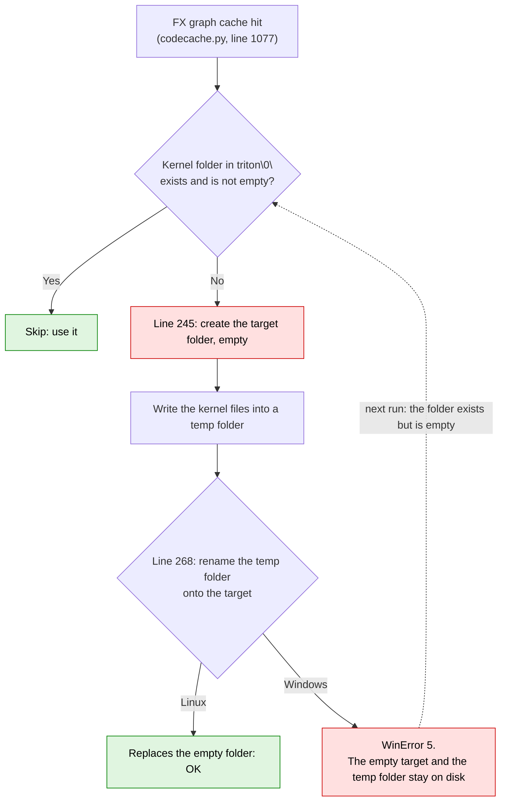

# [triton-windows PR #56] Document the PyTorch 2.6 `os.replace` error in the README

- Upstream PR: https://github.com/triton-lang/triton-windows/pull/56 (to the `readme` branch)
- Status: PR open
- Versions tested: torch 2.6.0+cu124 with triton-windows 3.2.0.post21; source compared with torch 2.7.0
- Found while working on [nano-vllm #190](../../nano-vllm/issues/190-cuda-graph-block-tables.md)
- Written: 2026-10-06

## TL;DR

- **The bug:** with PyTorch 2.6 on Windows, `torch.compile` can fail with `PermissionError: [WinError 5]` while it restores Triton kernels from its compile cache. After that, every run fails the same way.
- **Why:** `TritonBundler.read_and_emit` creates the target folder, then renames a temporary folder onto it. Linux allows renaming onto an empty folder; Windows does not.
- **Upstream:** fixed in PyTorch 2.7 by [pytorch#146481](https://github.com/pytorch/pytorch/pull/146481), as part of a larger fix for Inductor tests on Intel XPU on Windows. I found no issue reporting it, and there is no PyTorch 2.6.x release with the fix.
- **What I did:** reproduced it in a fresh environment without nano-vllm, and added a Known issues entry to triton-windows's README ([PR #56](https://github.com/triton-lang/triton-windows/pull/56)) with the error, the cause, and two ways out: PyTorch 2.7 or later, or `TORCHINDUCTOR_BUNDLE_TRITON_INTO_FX_GRAPH_CACHE=0`.
- **Why that README:** on Windows you only reach this code if you installed triton-windows, and its README pairs PyTorch 2.6 with Triton 3.2 and lists Turing/Volta GPUs as supported only up to Triton 3.2.

## What I learned
- Even a well-known package, e.g., Pytorch can has issues, which can further impact other packages!
- A kernel is stored twice in PyTorch -> fxgraph | triton
- In Pytorch, they first create temporary folders and files and then change names -> For atomic writing, avoid half-written foleders. 
- PR suggestions -> Only keep fixes/suggestions that works for everyone, try to simplify the words and description.  
- Need to read the build.md and PR template first -> found readme has rebase before PR.

## Environment

| | |
|---|---|
| Machine | Windows 11, NVIDIA GeForce RTX 4060 Laptop GPU (8 GB) |
| Python | 3.10.21, in a fresh conda environment |
| Packages | torch 2.6.0+cu124, triton-windows 3.2.0.post21, numpy 2.2.6, nothing else |

## Symptom

```
  File "...\torch\_inductor\codecache.py", line 1077, in _lookup_graph
    triton_bundler_meta = TritonBundler.read_and_emit(bundle)
  File "...\torch\_inductor\triton_bundler.py", line 268, in read_and_emit
    os.replace(tmp_dir, directory)
torch._dynamo.exc.BackendCompilerFailed: backend='inductor' raised:
PermissionError: [WinError 5] Access is denied: '...\\triton\\0\\tmp.<random id>' -> '...\\triton\\0\\<kernel hash>'
```

Once it fails, it fails on every later run. Deleting the empty `<kernel hash>` folder it leaves behind does not help: the next run creates it again.

I first hit it in nano-vllm, during the warmup before CUDA graph capture, in `SiluAndMul`, which is decorated with `@torch.compile`.

## Background: two caches

`torch.compile` keeps two caches under `%TEMP%\torchinductor_<user>\`:

| | What it holds | Written by |
|---|---|---|
| `fxgraph\` (FX graph cache) | the compiled graph and, since 2.6, a copy of the Triton kernels it uses (the "bundle") | Inductor |
| `triton\0\<kernel hash>\` (Triton cache) | one folder per compiled kernel: `.cubin` (the GPU binary), `.ptx`, `.ttir`, `.json` and so on | Triton |

When a later run hits the FX graph cache, Inductor checks whether each bundled kernel is already in `triton\0\`, and restores it from the bundle if it is not. The bug is in that restore. Normally the kernel folders are there and the restore is skipped, so simply running again never triggers it. It needs an FX graph cache entry whose kernel folder is missing from `triton\0\`.

## Root cause

[`TritonBundler.read_and_emit`](https://github.com/pytorch/pytorch/blob/1eba9b3aa3c43f86f4a2c807ac8e12c4a7767340/torch/_inductor/triton_bundler.py#L236-L268) in PyTorch 2.6, shortened:

```python
if os.path.exists(directory) and len(os.listdir(directory)) != 0:   # line 236: already there, skip
    continue
Path(directory).mkdir(parents=True, exist_ok=True)                  # line 245: creates the target, empty
tmp_dir = os.path.join(basedir, f"tmp.{rnd_id}")
os.makedirs(tmp_dir)                                                # line 250
...                                                                 # writes the kernel files into tmp_dir
# Atomic on POSIX systems
os.replace(tmp_dir, directory)                                      # line 268: renames onto the folder from line 245
```



Writing into a temporary folder and then renaming it is the usual way to make a write atomic: other processes never see a half-written folder, so "not empty" at line 236 can be trusted to mean "complete". Triton writes its own cache the same way, one file at a time ([`FileCacheManager.put`](https://github.com/triton-lang/triton/blob/9641643da6c52000c807b5eeed05edaec4402a67/python/triton/runtime/cache.py#L112-L136)).

The problem is line 245, which creates the target before the rename. On Linux, renaming onto an empty folder replaces it, so the extra `mkdir` is harmless and the tests pass. On Windows, `os.replace` cannot replace an existing folder, even an empty one. I ran the same five-line script on both: in WSL the rename succeeds, on Windows it raises WinError 5. The `mkdir` has been there since the first version of the file ([pytorch#138239](https://github.com/pytorch/pytorch/pull/138239)). It was fixed when Intel ran the Inductor tests on Windows on their own machines; their PR says they had no Windows CI for this yet.

## Reproduce

`repro.py`:

```python
import torch

@torch.compile
def f(x):
    return torch.sin(x) * 2

print(f(torch.randn(4, device="cuda")))
```

In PowerShell:

```pwsh
$Env:TORCHINDUCTOR_CACHE_DIR = "$Env:TEMP\inductor_repro"  # start from an empty cache
python repro.py  # OK, fills the FX graph cache (fxgraph\) and the Triton cache (triton\0\)

# Delete the Triton kernel folders, keep the FX graph cache
Get-ChildItem "$Env:TORCHINDUCTOR_CACHE_DIR\triton\0" -Directory | Where-Object { Get-ChildItem $_.FullName -Filter *.cubin } | Remove-Item -Recurse

python repro.py  # BackendCompilerFailed ... PermissionError: [WinError 5], leaves an empty <kernel hash> folder
python repro.py  # fails the same way again

$Env:TORCHINDUCTOR_BUNDLE_TRITON_INTO_FX_GRAPH_CACHE = "0"
python repro.py  # OK
```

Deleting the kernel folders is just a quick way to reach the state that triggers the bug. I don't know what removed the kernel folder on my machine the first time.

<details>
<summary>A longer run, with Inductor's counters at each step</summary>

Same idea with `torch.sin(x) * 2` on 1,024 elements, each step in a new process. The counters come from `torch._dynamo.utils.counters["inductor"]`: FX graph cache misses and hits, files copied into the bundle, and files restored by `read_and_emit`.

| Step | Action | Result | Counters |
|---|---|---|---|
| 1 | first run | OK | miss 1, bundled 14 files |
| 2 | run again | OK | hit 1, restored 0 (skipped at line 236) |
| 3 | delete the kernel folders, keep `fxgraph\` | | |
| 4 | run again | WinError 5 | restored 7 files, then the rename failed |
| 5 | run again | WinError 5 | the same |
| 6 | run with the variable set to `0` | OK | miss 1 |
| 7 | run with the variable back at `1` | WinError 5, on the other kernel | restored 7 files |

- **14 files for one function:** autotuning compiled two versions of the same kernel (`XBLOCK` 256 and 128), timed them, and kept 256. Both versions went into the bundle, 7 files each.
- **Step 4 shows hit 0:** `load_with_key` counts the hit only after `_lookup_graph` returns, and this time it raised first. The loop also stopped at the first kernel, so only one folder was left empty.
- **Step 6 misses:** the variable is part of the FX graph cache key, so changing it means a new entry and a new compile. Triton recompiled only the version that won autotuning, and filled the empty folder from step 4.
- **Step 7 fails again:** back at `1`, the old entry is used, and its bundle still has the losing version, which nothing rebuilt. So the variable avoids the bug but does not repair the cache. Deleting `fxgraph\` does: in a separate test, the next run missed and recompiled, and the one after hit, both without errors.

</details>

## Fix

PyTorch 2.7 ([pytorch#146481](https://github.com/pytorch/pytorch/pull/146481), commit [`b11d5cd`](https://github.com/pytorch/pytorch/commit/b11d5cd584)) changed [these lines](https://github.com/pytorch/pytorch/blob/134179474539648ba7dee1317959529fbd0e7f89/torch/_inductor/triton_bundler.py#L243-L273):

```diff
-                Path(directory).mkdir(parents=True, exist_ok=True)
+                Path(basedir).mkdir(parents=True, exist_ok=True)
 ...
-                # Atomic on POSIX systems
-                os.replace(tmp_dir, directory)
+                if _IS_WINDOWS:
+                    with FileLock(directory + ".lock"):
+                        if os.path.exists(directory):
+                            shutil.rmtree(directory)
+                        os.replace(tmp_dir, directory)
+                else:
+                    # Atomic on POSIX systems
+                    os.replace(tmp_dir, directory)
```

It no longer creates the target, and on Windows it deletes an existing target (such as an empty folder left by 2.6) before renaming. The fix commit is in v2.7.0 and not in v2.6.0.

**The workaround on 2.6.** `TORCHINDUCTOR_BUNDLE_TRITON_INTO_FX_GRAPH_CACHE` turns the bundle on or off; it is [on by default](https://github.com/pytorch/pytorch/blob/1eba9b3aa3c43f86f4a2c807ac8e12c4a7767340/torch/_inductor/config.py#L23-L27) in open-source builds. With `0`, [`collect`](https://github.com/pytorch/pytorch/blob/1eba9b3aa3c43f86f4a2c807ac8e12c4a7767340/torch/_inductor/triton_bundler.py#L144) copies nothing into the cache entry and [`read_and_emit`](https://github.com/pytorch/pytorch/blob/1eba9b3aa3c43f86f4a2c807ac8e12c4a7767340/torch/_inductor/triton_bundler.py#L224) returns at its first line. The kernels are still cached by Triton in `triton\0\`, and recompiled if missing. The bundle only helps when an FX graph cache entry is used without its Triton cache, as with a remote cache shared across machines, so on one machine it costs nothing:

| | First call, empty cache | First call, cache hit | FX graph cache entry |
|---|---|---|---|
| bundle on (`1`) | 2.0 s | 0.7–0.9 s | 137 KB |
| bundle off (`0`) | 2.0 s | 0.9 s | 6.6 KB |

**My PR** adds this entry to the Known issues section of triton-windows's README, after "Error with `os.rename`", a similar PyTorch bug:

> ### Error with `os.replace` in PyTorch 2.6
>
> If `torch.compile` fails with errors like
> ```
>   File "C:\...\Lib\site-packages\torch\_inductor\triton_bundler.py", line 268, in read_and_emit
>     os.replace(tmp_dir, directory)
> torch._dynamo.exc.BackendCompilerFailed: backend='inductor' raised:
> PermissionError: [WinError 5] Access is denied: '...\\triton\\0\\tmp.<random id>' -> '...\\triton\\0\\<kernel hash>'
> ```
> and it happens again every time you run your program, then it's a bug in PyTorch 2.6: it renames a temp folder onto an empty folder that it created itself, which is not allowed on Windows.
>
> This has been fixed since PyTorch 2.7, see https://github.com/pytorch/pytorch/pull/146481 . If you need to stay on PyTorch 2.6, you can set the environment variable `TORCHINDUCTOR_BUNDLE_TRITON_INTO_FX_GRAPH_CACHE=0`.

I left out deleting `fxgraph\`: its path depends on `TEMP` and `TORCHINDUCTOR_CACHE_DIR`, and the variable alone is enough to get going again.

## Verification

- The repro in the PR, in a fresh environment, in both PowerShell and cmd: OK, then WinError 5 twice, then OK with the variable set to `0`.
- The rename itself: the same script succeeds in WSL and raises WinError 5 on Windows.
- The PR: triton-windows's `pre-commit run --from-ref origin/readme --to-ref HEAD` passes, and the entry and the description render correctly on GitHub.
- The upstream fix: commit `b11d5cd` is in v2.7.0 and not in v2.6.0.

## Open question

- What removed the kernel folder from my cache in the first place? The FX graph cache entry was still there, so something deleted only part of `triton\0\`. I never found out.
